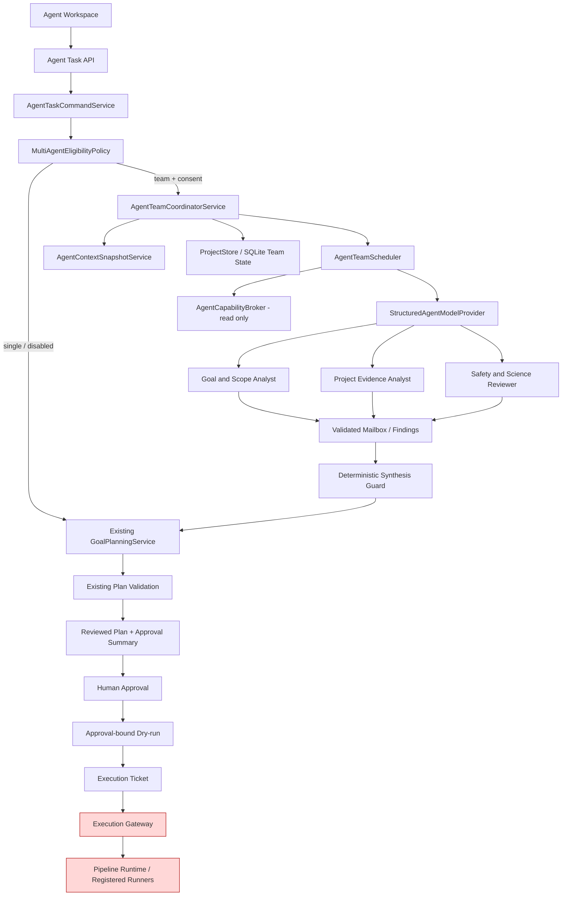
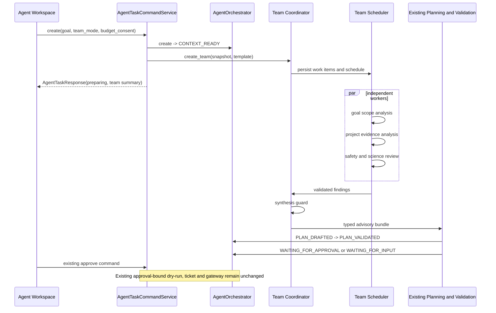

# MedImage Agent 多 Agent 协作运行时设计与实施计划

> 状态：Proposed，待能力评审后实施
>
> 文档类型：Architecture / Refactor + Feature Bundle 方案
>
> 适用基线：当前 `v0.6.0-rc1` / Phase 10 Agent-first 源码树
>
> 方案日期：2026-07-22
>
> 输入材料：用户提供的《Claude Code 源码：Multi-Agent 机制》PDF、当前仓库源码与测试、Anthropic 官方资料
>
> 离线 Gate 证据（2026-08-10）：`multi-agent-eval-v1` 的 30 个 synthetic/redacted
> fixture 在人工确认的 Gate 下通过；这只允许本设计进入独立 capability review，**不**
> 授权 durable Team PoC、公开 API、feature flag、scheduler 或生产执行能力。

## 0. 执行结论

本项目可以引入类似 Claude Code 的多 Agent 协作机制，但不应复制“多个 Agent 都拥有完整工具并可直接行动”的通用编码 Agent 模型。MedImage Agent 是受控的 rs-fMRI 研究工程平台，正确的落点是：

1. 在现有 Agent Task 的**规划与独立审查层**增加一个默认关闭、预算受限、可持久恢复的扁平 `Coordinator -> Workers` 协作运行时。
2. Coordinator 拆成两部分：确定性的控制面 Service 负责状态、预算、权限、审计和收敛；LLM 只负责受 schema 约束的任务分解建议与结果综合。
3. Worker 只读取经过裁剪和哈希绑定的项目上下文，输出结构化建议或审查结论；不得持有 Approval、Execution Ticket、Execution Gateway、node runner、文件写入、shell 或任意 MCP 能力。
4. 多 Agent 产出的最终候选仍必须进入现有 `GoalPlanningService -> Plan Validator -> Reviewed Plan -> Approval Summary -> 人工审批 -> 审批后 dry-run -> Execution Ticket -> Execution Gateway` 链路。
5. 不新增第二套顶层任务状态机；Team、Worker、Work Item 是 `AgentLifecycleRecord` 的从属执行域，Agent Task 继续是用户可见的唯一权威任务。
6. 首期只实现扁平两层、Coordinator 集中通信、最多 3 个 Worker、一次综合和一次有界复核；不实现递归 spawn、Agent 自治执行、自由 peer-to-peer、长时间无限循环或跨任务共享权限。
7. 当前 `v0.6.0-rc2` 收敛窗口冻结 public API、依赖和能力扩展（`PROJECT_STATE.md:114-117`）。因此本方案可作为下一阶段实施基线，但不能直接并入当前 release 收敛线，除非先重新打开 capability review。

推荐的首个生产用途是“复杂目标的并行只读分析 + 独立安全/科学审查”，而不是并行修改代码或并行运行科学 pipeline。这样能获得上下文隔离、并行探索和交叉审查的收益，同时保持项目现有审批、执行和科学真实性边界。

### 0.1 已完成的离线评估 Gate

`tests/fixtures/agent_eval/multi_agent/manifest.json` 冻结了 10 个 eligible、10 个
ineligible 与 10 个 adversarial synthetic/redacted case。固定三个只读角色由
`MultiAgentEvaluationService` 的 deterministic coordinator 汇总；该服务无
ProjectStore、provider、planner、Approval、Gateway、runner、runtime 或 scheduler
依赖，不能创建生产状态或副作用。

人工确认的初值在 manifest 中版本化：复杂 case 的 blocking-finding recall 相对
single baseline 至少提高 10 个百分点，平均 input token 不超过 3 倍，p95 latency
不超过 2.5 倍，且安全、项目隔离、审批和 scientific truthfulness 零退化。运行
`python scripts/run_multi_agent_evaluation.py --summary` 得到 manifest hash
`5e67e188fd0842a7b701b1f6dc2ab475c846cd18dc84c38da7ad890cd135138e`：recall 从
0.3889 提升到 0.6667，false blocker rate 从 0.1429 降至 0，input token 为 1.425 倍，
p95 latency 为 1.3 倍，Gate 通过。safety reviewer failure 会 truthful fallback，
contradiction 或无效 evidence ref 会 handoff；该评测没有宣布任何科学或执行结果。

这项证据不改变本文的 `Proposed` 状态，也不解除 RC2 capability-review、审批或唯一
Execution Gateway 的约束。

---

## 1. 任务模式、范围与非目标

### 1.1 任务模式

本方案属于：

- **Architecture / Refactor**：新增多 Agent 控制面、持久化从属状态、调度与恢复边界；
- **Feature Bundle**：需要后端、存储、API、前端、配置、测试和文档完整接入；
- **非 Scientific Validation**：不新增 ALFF/fALFF、ReHo、FC 等数值算法，不提升能力矩阵等级；
- **非 Release / Packaging**：本文件只规划实现；正式启用前必须另行执行打包和 GUI 验证。

### 1.2 必做目标

- 将复杂目标拆为可并行、可审计、依赖明确的只读 Work Item；
- 为每个 Worker 建立独立、最小化、不可变的上下文快照；
- 提供持久 mailbox、状态、事件、预算、租约、重试、取消和重启恢复；
- 支持独立角色从不同角度给出证据、风险、矛盾和候选建议；
- 由确定性控制面验证 Worker 输出并综合成现有 planner 可消费的 typed advisory；
- 保留单 Agent 默认路径和确定性 fallback；
- 在 Agent Workspace 中显示适度的 Team Activity，而不改变用户对审批和执行状态的理解；
- 对 token、延迟、失败、缓存、恢复、安全拒绝和最终质量建立可量化评估。

### 1.3 明确非目标

- 不让 LLM、Coordinator 或 Worker 直接执行 pipeline、node runner、外部命令或文件写入；
- 不让 Worker 审批计划、签发或消费 Execution Ticket；
- 不把 Agent 间消息当成用户授权或安全事实；
- 不实现递归 Team、Worker 再 spawn Worker、无限自治循环或跨项目 Agent；
- 不实现通用代码编辑 Agent、终端 Agent、浏览器 Agent或任意 MCP passthrough；
- 不让多 Agent 绕过当前 science decision、Plan Validator、Approval Gate 或结果真实性判断；
- 不依赖尚未实施的长期记忆系统；
- 不借此重写 Pipeline Runtime、Execution Gateway、scientific kernel 或 node registry；
- 不在本方案阶段修改版本号、发布产物或能力等级。

---

## 2. 调研证据与适配判断

### 2.1 用户提供 PDF 的可复用机制

PDF 描述了三种协作形态：普通 Subagent、Fork Subagent 和 Coordinator。其核心机制可归纳为：

| 机制 | PDF 中的作用 | 本项目的处理 |
|---|---|---|
| 独立上下文 | 子 Agent 有自己的对话、工具和状态 | 采纳，但改为 typed immutable snapshot，不复制完整父会话 |
| 邮箱通信 | 父子通过 message/pending mailbox 异步通信 | 采纳，改为 SQLite 持久化、Pydantic 校验、哈希和 project scope |
| 完成通知 | 子 Agent 完成后向父 Agent 注入结果 | 采纳语义，不把事件伪装成 user message，由 Scheduler/Event Store 投递 |
| Fork 与前缀复用 | 完整继承 system/user/tool 前缀以提高 prompt cache 命中 | 延后；首期优先角色隔离和最小上下文，只保留 byte-stable prompt 模板思想 |
| Coordinator | 纯协调、并行派工、收集并综合 | 采纳，但 Coordinator 控制面必须是确定性 Service，LLM 不能拥有调度权威 |
| 扁平两层 | Worker 不再递归 spawn | 首期强制采用 |
| 分层工具权限 | global/custom/async 不同 allowlist | 采纳 deny-by-default 思想，替换为 service capability allowlist |
| 并行优先 | 独立任务并行，存在依赖时串行 | 采纳，由 DAG 和持久租约实现 |

PDF 中不适合直接复制的部分：

- “MCP 工具默认全允许”与本项目 `LLM advice-only` 冲突，必须改为默认全拒绝；
- 子 Agent 继承完整工具集合会扩大 blast radius，本项目 Worker 只能访问只读业务能力；
- XML 风格 completion 直接注入对话容易混淆系统事件、用户输入和不可信 Agent 内容，本项目必须使用结构化 envelope；
- “运行两分钟后自动后台化”是 UI/进程策略，不应决定任务是否异步；本项目按用户选择和 task mode 从开始即持久化异步；
- 完整 transcript fork 会传播无关内容、潜在 PHI 和 prompt injection；本项目采用最小上下文快照；
- 允许完成 Agent 恢复整个 transcript 不是首期必需能力；首期用新 attempt + 旧 finding 引用实现可审计续作。

### 2.2 官方资料补全与校正

官方 Claude Code 文档将 Agent Team 定义为 lead、独立 context 的 teammates、共享 task list 和 mailbox，并明确 Team 仍属实验特性，存在 session resume、任务协调和 shutdown 限制。官方实现还允许 teammate 之间直接消息，而 PDF 更强调 coordinator 集中收敛。本项目首期选择更严格的中心化通信，是基于医疗研究工程安全和审计要求的有意差异，而不是遗漏。

Anthropic 的多 Agent Research 工程总结表明，该模式最适合可广度并行的独立探索；高依赖、需要共享同一上下文的任务收益较差，且 token 成本显著增加。因此本项目必须用确定性 eligibility policy 选择任务，并对 team size、token、round、wall time 和重试设置硬预算。

Prompt cache 依赖稳定前缀，顺序为 `tools -> system -> messages`；工具定义或前缀变化会使后续缓存失效。因此“Fork”只能作为性能优化，不能成为正确性依赖。首期应先固定 role prompt、稳定 schema 序列化和 context block 顺序，再按 provider 能力逐步启用缓存。

官方来源：

- [Claude Code Agent Teams](https://code.claude.com/docs/en/agent-teams)
- [Claude Code Agents and Parallel Work](https://code.claude.com/docs/en/agents)
- [How we built our multi-agent research system](https://www.anthropic.com/engineering/multi-agent-research-system)
- [Prompt caching](https://platform.claude.com/docs/en/build-with-claude/prompt-caching)
- [Tool use with prompt caching](https://platform.claude.com/docs/en/agents-and-tools/tool-use/tool-use-with-prompt-caching)

---

## 3. 当前项目真实基线与差距

### 3.1 已有可复用能力

| 当前能力 | 代码锚点 | 多 Agent 复用方式 |
|---|---|---|
| Agent 顶层有限状态机与合法迁移 | `src/backend/app/services/agent_orchestrator.py:60-89`、`:209` | 保持为唯一顶层状态机；Team 是从属状态 |
| 版本化 lifecycle record | `src/backend/app/schemas/agent_lifecycle.py:14-32`、`:112` | 仅增加可选 `planning_team_id` 或 command context binding，不添加 Team 专用顶层状态 |
| 创建、回答、审批、取消、恢复命令 | `src/backend/app/services/agent_task_command_service.py:126`、`:190` | 在 create/planning seam 接入 Team；审批和执行顺序不变 |
| Plan-only 零执行 | `agent_task_command_service.py:421-496` | Team 只做规划分析；仍不得产生 dry-run、ticket、run 或数值产物 |
| 审批后 dry-run 与稳定 Approval Summary | `agent_task_command_service.py:190-536` | Team 综合结果必须在 Approval Summary 生成前冻结 |
| 只读 Agent Task 投影 | `agent_task_read_model.py` | 增加可选 Team Summary；GET 不触发 reconcile |
| 有界终态协调与 monitor | `agent_task_reconciler.py:27-31`、`:138` | 复用“有界、单 owner”原则，但 Team 需独立 durable lease |
| 唯一 Execution Gateway | `src/backend/app/runtime/execution_gateway.py:55-59` | 保持完全隔离；Worker 无引用、无 capability |
| SQLite lifecycle/event 存储 | `src/backend/app/services/mock_store.py:177-198` | 同一 desktop state DB 增加 Team 表和事务性 claim |
| ProjectStore Protocol | `src/backend/app/api/dependencies.py:88-98` | 扩展 typed Team repository 方法，Service 不依赖 concrete store |
| OpenAI-compatible planner provider | `src/backend/app/planner/llm_provider.py:46-48`、`:236` | 提取通用 structured model adapter；同步当前调用方并删除被替换入口 |
| Agent Workspace 与 3 秒有界状态轮询 | `useAgentTaskController.ts:39`、`:208-212` | 同一 controller 展示 Team Summary，不建立第二套长期轮询 |

### 3.2 不能直接复用的现有模块

| 模块 | 原因 | 决策 |
|---|---|---|
| `runtime/agent_plan.py` | 历史旧 plan 运行时，曾直接写 `work/agent_runs/.../plan.json` | 已在阶段十三移除；不作为 Team 入口，也不保留双合同 |
| `runtime/background_task_manager.py` | 模块级 `ThreadPoolExecutor(max_workers=2)`、进程内任务表、无 durable lease/cancel/restart owner | 不扩建；新建 lifespan-owned Team Scheduler |
| `services/task_manager.py` | 面向旧 pipeline task/mock store，不是 Agent Task lifecycle | 不复用为 Team 状态机 |
| `runtime/tool_catalog.py` | 是 pipeline node 描述目录，不是 Agent capability broker；没有完整 read/write/destructive 语义 | 只作为只读 planning evidence；新建 Agent Capability Catalog |
| `runtime/tool_registry.py` | 描述 pipeline 工具执行属性，实际工具仍可能写文件 | 不能直接给 Worker；仅作为 safety reviewer 的只读元数据 |
| `runtime/memory_store.py` | 旧 file-backed memory，无当前 planner 消费和权威事务语义 | 多 Agent MVP 不依赖 |

### 3.3 当前规范冲突

- `specs/规范/平台与运行时/智能体运行时规范.md:34-42` 明确 MVP 不支持 multi-agent communication、UI、database 和 background review；实施本方案时必须版本化更新该正式规范。
- `PROJECT_STATE.md:114-117` 冻结 public API、依赖和能力扩展；需要先完成 capability review，再进入实现分支。
- `docs/安全与审批/安全边界.md:83-101` 规定 LLM 只能规划、建议、解释，并必须经 validator 和 Approval Gate；本方案把该规则扩展到所有 Worker 和 synthesis model。
- 当前未跟踪的 `docs/架构与决策/记忆系统设计方案.md` 也会修改 `AgentTaskCommandService`、ProjectStore、Reviewed Plan identity 和 read model。两项工作不能并行写同一文件；应采用单一 owner、顺序集成。

---

## 4. 目标架构

### 4.1 总体原则

1. **控制面确定性，模型面建议性**：调度、状态、权限、预算、租约、重试、收敛条件由 Python Service 决定；模型不能自行 spawn 或标记完成。
2. **执行面保持唯一**：只有现有审批链可以创建 ticket，只有 Execution Gateway 可以 dispatch。
3. **上下文按字段隔离**：不复制父会话；只组装任务需要的 typed snapshot。
4. **消息是数据，不是授权**：所有 Agent 消息都标记来源、schema、project、hash 和可信级别。
5. **扁平、有界、可恢复**：最多两层、固定角色上限、固定轮次、固定预算、持久 work item 与 lease。
6. **单 Agent 默认可用**：Team 关闭、provider 失败或任务不适合并行时，原路径继续工作。
7. **安全失败**：安全 reviewer 缺失、证据矛盾、context drift、预算异常或 project mismatch 不得静默综合成可审批计划。

### 4.2 组件关系



### 4.3 Coordinator 的双层实现

| 层 | 责任 | 禁止事项 |
|---|---|---|
| `AgentTeamCoordinatorService` | 选择模板、创建 team/work items、冻结 context、启动 scheduler、检查依赖、验证 findings、处理矛盾、完成或失败、调用现有 planner | 不执行 node，不直接读写任意文件，不让模型控制状态机 |
| `CoordinatorSynthesisModel` | 在完整 findings 集上给出结构化综合建议、未决问题和置信度 | 不创建 Worker、不决定预算、不变更 lifecycle、不批准、不执行 |

这样保留 PDF 的“协调者必须综合而不是转发”原则，同时避免 LLM 成为系统控制平面。

---

## 5. 首期角色、适用场景与路由

### 5.1 内置角色

MVP 仅允许版本化、代码内置角色；不接受用户自由上传 prompt 或 tools。

| role_id | 输入 | 输出 | 允许能力 | 明确禁止 |
|---|---|---|---|---|
| `goal_scope_analyst.v1` | goal、goal contract、支持目标目录摘要 | intent、子目标、非目标、歧义、建议问题 | 读取 goal/context schema | 文件、网络、执行、审批 |
| `project_evidence_analyst.v1` | project context、registered input/artifact metadata、readiness | 输入可用性、缺失前提、证据 refs、风险 | 只读 project projection | rawdata 内容、文件扫描、写入 |
| `safety_science_reviewer.v1` | goal、候选 advisory、tool catalog、安全与能力快照 | blocking finding、science decision、scope/path 风险 | 只读 catalog/policy/capability snapshot | 修改 plan、降低 gate、执行 |
| `result_evidence_reviewer.v1` | Observation、Goal Evaluation、artifact metadata | 独立一致性审查和 warning | 只读 post-run evidence | 覆盖 deterministic evaluator、把 metadata 提升为 computed |

`result_evidence_reviewer.v1` 放在后续阶段启用。首期规划团队通常使用前 3 个角色；简单任务只使用原单 Agent 路径。

### 5.2 Team 使用策略

新增 `team_mode`：

- `single`：默认；完全保持现有行为；
- `team`：用户在高级设置明确选择并确认模型调用预算；
- `auto`：仅在管理员开启、用户已预先同意成本/数据策略且 eligibility 命中时使用。

确定性 `MultiAgentEligibilityPolicy` 根据下列信号判断，而不是让 LLM 自行决定是否 spawn：

- 目标同时涉及两个以上独立证据域，例如数据就绪、科学参数和安全 scope；
- 需要独立反方审查或存在多个可竞争解释；
- 上下文超过单次 planner 的裁剪阈值，但可以拆成互不依赖的投影；
- 任务价值足以覆盖配置预算；
- 没有被 privacy/config policy 禁止外部模型调用。

以下场景强制 `single`：

- 简单状态查询、单一已知目标、纯 UI 命令；
- 多个 Work Item 必须持续共享完整上下文或严格串行；
- provider 不可用且 deterministic planner 足够；
- 安全策略禁止发送任何项目上下文；
- 当前实例已有同一 task 的活跃 team；
- 配置、预算或 capability review 未开启。

Plan-only 可以使用 Team 做并行规划审查，但 `execution_performed=false`、无 approval/dry-run/ticket/run 的现有不变量保持不变。

---

## 6. 上下文隔离设计

### 6.1 `AgentContextSnapshot`

每个 Team 创建时生成不可变快照，并以 canonical JSON hash 绑定：

```text
AgentContextSnapshot v1
├─ project_id, lifecycle_id, team_id
├─ goal_text, goal_hash, goal_contract_ref
├─ project_context_ref, project_context_hash
├─ registered_input_refs[]
├─ capability_snapshot_ref, capability_snapshot_hash
├─ safety_policy_version
├─ role_prompt_version, output_schema_version
├─ memory_context_ref?            # 仅未来记忆系统落地后允许
├─ redaction_policy_version
└─ created_at, expires_at, snapshot_hash
```

上下文只包含 planner 已允许消费的项目投影和 evidence ref；不默认包含原始数据字节、受试者标识、完整路径列表、API key、审批 actor credential、ticket secret、父会话 transcript、前端本地状态或任意历史消息。

### 6.2 字段级隔离矩阵

| 字段类别 | Worker 行为 | 理由 |
|---|---|---|
| 静态治理、role prompt、schema | CLONE，按版本固定 | 支持审计和稳定前缀 |
| goal、typed project projection | CLONE，按角色裁剪 | 避免完整上下文污染 |
| lifecycle/team/work item ID | SHARE，只读 | 关联审计和消息 |
| cancellation epoch、budget ledger | REFERENCE，通过 runtime 检查 | Worker 不得自行修改 |
| evidence/artifact | REFERENCE，只读 typed API | 避免复制大对象和直接文件访问 |
| approval、ticket、gateway context | DENY | 防止越权和权限继承 |
| rawdata/NIfTI/DICOM 内容 | DENY，首期只给注册元数据 | 控制 PHI 与 token 泄露 |
| API key/provider credential | DENY，由 provider adapter 持有 | Worker prompt 永不接触密钥 |
| 父 Agent transcript | DENY | 降低 prompt injection、PHI 和无关 token |
| 长期记忆 | DENY（MVP）；未来只给 hash-bound projection | 避免与未落地记忆方案耦合 |

### 6.3 Context drift

- Team 创建后 project evidence、capability snapshot 或 goal 变化，不原地修改 snapshot；
- `answer/update goal` 必须取消旧 team，递增 `team_epoch`，创建新 snapshot 和新 team；
- 迟到 Worker 结果携带旧 epoch，store 可以保留审计，但 synthesis 必须拒绝；
- 最终 Reviewed Plan 记录 `team_id`、`context_snapshot_hash`、ordered finding hashes 和 synthesis policy version；
- Team 完成后项目状态变化不改变已保存 Reviewed Plan，仍由现有 plan hash/Approval Summary 稳定性检查保护。

---

## 7. Work Item、Mailbox 与消息协议

### 7.1 Work Item DAG

首期 Work Item 由代码内置模板生成，不允许模型任意创建：

```text
W1 goal_scope_analysis ───────┐
                              ├─> W4 synthesis_guard
W2 project_evidence_analysis ─┤
                              │
W3 safety_science_review ─────┘
```

状态：`PENDING -> CLAIMED -> RUNNING -> SUCCEEDED | FAILED | TIMED_OUT | CANCELED`。

约束：

- 只有所有 dependency `SUCCEEDED` 或被 policy 标记为可接受 partial，Work Item 才可 claim；
- claim 使用 SQLite 事务、lease expiry 和 fencing token，不能依赖进程内锁或文件锁；
- 同一 `(team_id, role_id, attempt)` 唯一；
- `SUCCEEDED` 必须有通过 schema 和 evidence 校验的 finding；
- 安全审查不能以 partial 成功跳过；
- completion hook 由 Service 检查，模型无权直接置完成。

### 7.2 Mailbox envelope

```json
{
  "schema_version": 1,
  "message_id": "msg_...",
  "team_id": "team_...",
  "project_id": "project_...",
  "sender": {"kind": "worker", "id": "worker_...", "role_id": "..."},
  "recipient": {"kind": "coordinator", "id": "coordinator"},
  "message_type": "finding",
  "team_epoch": 3,
  "work_item_id": "work_...",
  "sequence": 7,
  "payload_ref": "finding_...",
  "payload_hash": "sha256:...",
  "created_at": "..."
}
```

所有 payload 必须：

- 经过 Pydantic `extra=forbid` 校验；
- 限制 bytes、列表长度、字符串长度和证据数量；
- 将自由文本视为 untrusted advisory；
- 不允许包含命令、工具调用、approval claim、ticket 或任意 credential；
- 使用 project/team/epoch 三重 scope；
- append-only，消费用 cursor/ack 记录，不原地覆盖正文；
- 对 malformed entry 隔离并记录事件，不能阻塞同 mailbox 的其他有效消息。

### 7.3 通信拓扑

MVP 只允许：

```text
Coordinator -> Worker: immutable work assignment / cancellation
Worker -> Coordinator: progress / finding / failure / completion
```

不允许 Worker 直接给 Worker 发消息。需要交叉质疑时，由 Coordinator 创建一次有界 `review_request`，将已裁剪、已标注来源的 finding 发送给 reviewer。这样可以避免消息洪泛、权限转借和未经审计的共识形成。自由 peer-to-peer 只有在后续评估证明必要时才考虑。

---

## 8. 权限、安全、隐私与科学边界

### 8.1 Agent Capability Broker

不要把 `ToolCatalog` 或 `ToolRegistry` 直接暴露为 Worker tools。新建专用 `AgentCapabilityBroker`，首期只允许下列只读能力：

| capability_id | 数据来源 | 允许角色 |
|---|---|---|
| `goal_contract.read` | 已持久化 goal contract | goal、safety |
| `project_context.read` | `ProjectContext` typed projection | project、safety |
| `registered_inputs.read` | ProjectStore read model | project |
| `tool_catalog.describe` | pipeline node metadata，不返回 callable | safety、goal |
| `capability_matrix.read` | 版本化 capability snapshot | safety |
| `reviewed_plan.read` | 已保存 plan，post-plan review only | safety/result |
| `observation.read` | ObservationSummary | result |
| `goal_evaluation.read` | GoalEvaluationSummary | result |
| `artifact_metadata.read` | 注册、checksum、reloadable metadata | result |

所有未列出的能力默认拒绝，特别是：

- `ExecutionGateway.dispatch`；
- ticket create/consume；
- lifecycle transition；
- Approval Summary approve；
- node runner、Pipeline Runtime、MATLAB/SPM/DPABI/GPU/DICOM 外部执行；
- 文件系统、shell、任意 HTTP、web search、MCP；
- rawdata 内容读取或写入；
- memory write、project mutation、用户消息模拟；
- spawn/cancel 其他 Agent。

### 8.2 授权与审批不传播

- 用户勾选“多 Agent 分析”只授权额外的规划模型调用及其预算，不授权科学执行；
- Agent 消息中声称“用户已批准”一律不可信；
- Worker 不接收 approval actor、summary approval token 或 execution context；
- Coordinator 的 Service 身份只能调用 planning/lifecycle 的合法命令，不持有 `VerifiedExecutionContext`；
- 最终执行仍严格遵循 `Reviewed Plan -> stable Approval Summary -> user approval -> dry-run -> ticket -> gateway`；
- safety reviewer 的“通过”不能代替 Approval Gate，其“阻断”则必须 fail closed 或要求人工处理。

### 8.3 数据外发与 PHI

- 默认只发送 goal、能力元数据、哈希、聚合计数和去标识 evidence；
- 原始文件名、受试者 ID、绝对路径、DICOM tag、图像内容默认不得进入 prompt；
- provider 配置必须声明 data residency、日志/retention policy 和是否允许外部上下文；
- UI 在开启 Team 前展示 provider、最大预算、可能发送的数据类别；
- prompt/result 默认只保存 hash、模型、usage、schema 结果和经裁剪摘要；原始 prompt 日志默认关闭；
- 任何可选 debug transcript 必须单独开关、受 project scope 和保留期控制，不能进入普通应用日志。

### 8.4 科学真实性

- Worker finding 只能是 `advisory`、`warning` 或 `blocking_finding`；
- capability level 仍来自能力矩阵和实际产物，Worker 不能输出 `computed/validated` 作为权威状态；
- scientific parameter 建议仍经当前 science decision、plan validator、Reviewed Plan 和用户审批；
- post-run reviewer 不能覆盖 `ObservationService`、`GoalEvaluationService` 或 result summary 的确定性判定；
- 多 Agent 成功只表示协作流程完成，不表示科学目标完成。

---

## 9. 状态、持久化与恢复

### 9.1 不新增第二套顶层生命周期

Team 在顶层 lifecycle 的映射：

| AgentLifecycleState | Team 行为 |
|---|---|
| `CREATED` | 尚未创建 Team |
| `WAITING_FOR_INPUT` | 不运行 Team；回答后旧 Team 作废 |
| `CONTEXT_READY` | 可创建/运行 planning Team；前端仍显示 `preparing` |
| `PLAN_DRAFTED` | Team findings 已综合，开始现有 plan finalize |
| `WAITING_FOR_SCIENCE_DECISION` | Team 结束；等待用户，回答后重新规划可创建新 Team |
| `PLAN_VALIDATED` / `WAITING_FOR_APPROVAL` | planning Team sealed，只读可查 |
| `RUNNING` 以后 | 首期不运行 planning Worker；后续可创建只读 result review Team |
| 终态/取消 | 所有活跃 Team 取消或 seal，不影响终态真实性 |

用户可见状态仍使用现有 `preparing / awaiting_input / awaiting_approval / running / completed / needs_attention / canceled`，Team status 只是嵌套 technical detail。

### 9.2 新增持久表

建议在现有 desktop state SQLite 中新增：

1. `agent_teams`
   - `team_id PK`、`project_id`、`lifecycle_id`、`team_epoch`、`mode`、`status`；
   - `context_snapshot_hash`、`role_registry_version`、`synthesis_policy_version`；
   - 预算上限与已用量；
   - `created_at/updated_at/sealed_at`；
   - unique `(lifecycle_id, team_epoch)`。
2. `agent_workers`
   - `worker_id PK`、`team_id`、`role_id/version`、`status`、`attempt`；
   - `model/provider`、prompt hash、output schema version；
   - token/cache/latency usage、heartbeat、error code。
3. `agent_work_items`
   - `work_item_id PK`、`team_id`、template key、dependencies JSON；
   - status、attempt、lease owner/expiry、fencing token；
   - input snapshot hash、finding id、failure code；
   - unique `(team_id, template_key, attempt)`。
4. `agent_findings`
   - `finding_id PK`、`team_id/work_item_id/worker_id`；
   - typed payload JSON、payload hash、evidence refs、confidence、created_at；
   - append-only。
5. `agent_mailbox_messages`
   - envelope 字段、recipient sequence、payload ref/hash、ack cursor；
   - unique `(recipient_kind, recipient_id, sequence)` 和 `message_id`。
6. `agent_team_events`
   - append-only audit event；
   - `event_id`、team/project/lifecycle、event type、actor kind/id、payload、occurred_at；
   - command/idempotency key 唯一约束。

所有 JSON payload 带 `_schema_version` 或明确 `schema_version`；SQLite 的结构升级必须增量、可重复运行，并原子升级到唯一当前持久格式，不保留旧数据库读取路径或迁移兼容层。

### 9.3 Durable lease 与 fencing

- Scheduler claim Work Item 时在单事务内检查 `PENDING`/过期 lease、增加 fencing token 并写事件；
- Worker 完成时必须提交相同 fencing token、team epoch 和 snapshot hash；
- 进程重启后 startup reconcile 将过期 `CLAIMED/RUNNING` 置为 retryable `PENDING` 或 `FAILED`，受 attempt budget 限制；
- 迟到 completion 只记录 `STALE_RESULT_REJECTED`，不能覆盖新 attempt；
- 同一 Team 只允许一个 coordinator lease owner；
- 不用模块级全局 executor 或仅进程内 `Lock` 证明 owner 唯一。

### 9.4 取消与 shutdown

- 顶层 cancel 命令先按现有 lifecycle 规则判断是否合法，再设置 Team cancellation epoch；
- Scheduler 立即停止领取新 Work Item；
- 正在进行的 HTTP 请求通过 timeout/cancellation token 尽力中止；不能中止时，结果因旧 epoch 被拒绝；
- 应用 lifespan shutdown：停止接单、等待有界 grace period、释放/过期 lease、关闭 executor；
- Electron sidecar 正常或异常退出后不得遗留 Team owner 或后台进程；
- Team cleanup 不物理删除审计记录，只 seal；按未来 retention policy 归档。

---

## 10. 模型适配、结构化输出与缓存

### 10.1 Provider 抽象

当前 `OpenAICompatibleProvider` 针对 planner 的单一 `/chat/completions` 请求。新增协议：

```python
class StructuredAgentModelProvider(Protocol):
    def complete(
        self,
        *,
        role: AgentRoleSpec,
        context: AgentContextSnapshot,
        work_item: AgentWorkItem,
        output_schema: type[BaseModel],
        timeout_seconds: float,
        idempotency_key: str,
        cancellation_token: CancellationToken,
    ) -> AgentModelResult: ...
```

`AgentModelResult` 至少包含：provider/model、validated output、input/output token、cache read/write token、latency、finish reason、request id、prompt hash、raw response hash、warning。原始 response 只有在安全 debug policy 允许时短期保存。

首期可以提供：

- `OpenAICompatibleAgentProvider`：复用现有 base URL/key/HTTP 注入模式；
- `RuleBasedAgentProvider`：测试、离线和 deterministic fallback；
- `FakeAgentProvider`：单元测试用脚本化响应，禁止真实网络。

Provider 不得直接读取环境变量；由 `ConfigService` 注入 versioned settings。planner accessor 改动必须同步全部调用方并删除被替换入口。

### 10.2 输出 schema

每个角色使用独立 Pydantic schema，禁止一个通用 `dict[str, Any]`：

```text
GoalScopeFinding
ProjectEvidenceFinding
SafetyScienceFinding
ResultEvidenceFinding
SynthesisAdvisoryBundle
```

共同字段：`summary`、`claims[]`、`evidence_refs[]`、`uncertainties[]`、`blocking_findings[]`、`suggested_questions[]`、`confidence`、`schema_version`。所有 evidence ref 必须能在当前 project 中解析，不能引用 Worker 自造路径。

校验失败处理：

1. 同一 attempt 允许一次 schema repair，请求只带错误摘要和原响应 hash；
2. 仍失败则 Work Item `FAILED`；
3. safety role 失败不得 fallback 为“通过”；
4. 非安全 role 超时可按 policy 使用 deterministic planner fallback，并在 Team Summary 标记 partial；
5. 任何 provider error 不得直接变成用户看不懂的“服务不可用”，需结构化 error code 和可恢复动作。

### 10.3 Prompt cache 与“Fork”阶段

首期不复制父会话，不以 cache 命中作为验收条件。先做到：

- role system prompt byte-stable，并通过 `role_prompt_version` 管理；
- capability/schema 固定顺序和 canonical serialization；
- 静态治理在前，动态 snapshot 在后；
- prompt hash 和 provider usage 可观测；
- 同一 Team 的独立 Worker 可以共享相同静态前缀，但动态 role/context 分开。

后续在 provider 明确支持时实现 `PromptCachePolicy`：

- provider capability detection，而不是假设 OpenAI-compatible 都支持 Anthropic cache control；
- 记录 cache creation/read token、hit ratio 和 cost；
- 并发首请求尚未形成 cache 时允许 miss，不影响结果；
- 工具/schema/prompt version 变化导致 miss 属正常，不回退正确性；
- 不为了命中缓存而给 Worker 额外工具或完整父 transcript。

---

## 11. 与现有 Agent Task 调用链的精确接入

### 11.1 创建路径



### 11.2 Service 重构边界

`AgentTaskCommandService._plan()` 当前同时完成 context planning、decision handling、Reviewed Plan 保存、plan-only、Approval Summary 和 lifecycle transition。实施时应做最小职责拆分：

- `AgentTaskPlanningCoordinator.start_or_finalize(...)`
  - 单 Agent：同步获得 advisory/candidate；
  - Team：创建 team 后返回 `PREPARING`，由 scheduler 完成后调用 public finalize command；
- `AgentTaskPlanFinalizer.finalize(...)`
  - 接收 canonical goal/context + optional `SynthesisAdvisoryBundle`；
  - 调用现有 GoalPlanningService/validator；
  - 处理 science decision；
  - 保存 Reviewed Plan、plan-only 结果或 Approval Summary；
  - 使用 command/idempotency key 保证只 finalize 一次。

不能让后台线程调用 `_plan` 私有方法，也不能复制一套“Team planner”绕过当前 planner/validator。

### 11.3 失败与 fallback

| 情况 | 行为 |
|---|---|
| Team 未启用/不适合 | 原单 Agent 路径 |
| provider 不可用，且 deterministic planner 支持该目标 | 记录 `TEAM_PROVIDER_UNAVAILABLE`，取消 Team，使用单 Agent fallback，UI 标记 warning |
| 非安全 Worker 超时 | 一次 retry；仍失败可 partial synthesis 或 fallback，必须显式标记 |
| safety reviewer 失败/缺失 | 阻断 finalize，转 `WAITING_FOR_INPUT` 或 `HANDOFF_REQUIRED`，不得视为通过 |
| findings 相互矛盾 | deterministic contradiction policy；可创建一次 reviewer round，仍冲突则要求用户/人工处理 |
| context hash 变化 | seal 旧 Team，拒绝迟到结果，重新规划 |
| budget 用尽 | 停止新工作；仅在已有证据满足最小完整性时 partial synthesis，否则 handoff |
| scheduler 重启 | lease reconcile 后继续未完成 Work Item；不重复已提交 finding |
| cancellation | cascade Team cancel；不产生 Reviewed Plan 或执行副作用 |

---

## 12. API 与前端设计

### 12.1 公共 contract

为了保持兼容，外层 `AgentTaskResponse.schema_version` 可在纯 additive 阶段继续为 `1`；新增嵌套对象自身版本化：

```text
AgentTaskCreateRequest
  + team_mode?: "single" | "team" | "auto" = "single"
  + team_budget?: {max_workers, max_input_tokens, max_output_tokens, max_wall_seconds}
  + team_consent?: {provider_context_allowed: bool, accepted_at: datetime}

AgentTaskResponse
  + team?: AgentTaskTeamSummary | null

AgentTaskTeamSummary v1
  team_id, status, mode
  workers_total/running/completed/failed
  work_items_total/completed/blocked
  budget_used/budget_limit
  is_partial, warning_codes[]
  started_at, updated_at, sealed_at
```

只有当顶层字段语义、已有 state/outcome 含义或必填项变化时，才把外层 schema 升为 v2；发布时同步更新全部 client 和测试，仅保留唯一当前合同。

### 12.2 路由

现有 Agent Task route 继续负责 create/answer/approve/cancel/recovery。新增只读 domain router：

- `GET /api/projects/{project_id}/agent/tasks/{task_id}/team`
- `GET /api/projects/{project_id}/agent/tasks/{task_id}/team/work-items`
- `GET /api/projects/{project_id}/agent/tasks/{task_id}/team/events?after=<cursor>&limit=<n>`

MVP 不增加独立 team create/delete/send-message 命令：

- Team 只能由 Agent Task create/answer 受控创建；
- 顶层 cancel 自动 cascade；
- 用户不能直接给 Worker 注入自由文本；
- GET 必须纯读，不 reconcile、不 claim、不发送消息。

Router 只处理 HTTP、Depends、schema 和 `raise_api_error()`；所有 project scope、cursor、limit、authorization 由 Service/Store 校验。

### 12.3 前端

默认视图继续保持一个权威 `current action`。新增：

- Goal Composer 高级项：`使用多 Agent 分析`，显示 provider、预算和数据类别；默认关闭；
- `TeamActivityCard`：在 `preparing` 时显示“3 个角色中 2 个完成”等摘要；
- Advanced Mode 的 `TeamDetails`：角色、work item、依赖、状态、partial warning、证据链接、token/时间预算；
- 不显示内部 system prompt、原始 mailbox、未裁剪 model response 或绝对路径；
- loading、empty、disabled、partial、failure、canceled、resuming 全部有独立 i18n 文案；
- controller 继续以 Agent Task 为 owner，project 切换时 abort/清空 Team detail；
- Team 终止或任务离开 polling state 后停止轮询；事件使用现有 cursor 思路，不能用本地 optimistic 状态推断完成。

---

## 13. 配置与默认值

配置必须进入 `ConfigService`/typed settings，并使用 `MEDIMAGE_` 前缀。建议：

```dotenv
MEDIMAGE_MULTI_AGENT_ENABLED=0
MEDIMAGE_MULTI_AGENT_DEFAULT_MODE=single
MEDIMAGE_MULTI_AGENT_MAX_ACTIVE_TEAMS=1
MEDIMAGE_MULTI_AGENT_MAX_WORKERS=3
MEDIMAGE_MULTI_AGENT_MAX_ROUNDS=2
MEDIMAGE_MULTI_AGENT_MAX_ATTEMPTS=2
MEDIMAGE_MULTI_AGENT_MAX_WALL_SECONDS=180
MEDIMAGE_MULTI_AGENT_WORKER_TIMEOUT_SECONDS=60
MEDIMAGE_MULTI_AGENT_MAX_INPUT_TOKENS=30000
MEDIMAGE_MULTI_AGENT_MAX_OUTPUT_TOKENS=6000
MEDIMAGE_MULTI_AGENT_MAX_MESSAGES=24
MEDIMAGE_MULTI_AGENT_LEASE_SECONDS=90
MEDIMAGE_MULTI_AGENT_SHUTDOWN_GRACE_SECONDS=10
MEDIMAGE_MULTI_AGENT_ALLOW_EXTERNAL_CONTEXT=0
MEDIMAGE_MULTI_AGENT_STORE_RAW_TRANSCRIPTS=0
```

原则：

- 默认关闭，且默认 `single`；
- 配置有 hard ceiling，API 请求只能进一步收紧，不能扩大；
- 不接受 `latest` 模型；provider/model 必须显式配置和记录；
- invalid/unsafe config 启动时 fail closed，并在 readiness 中报告；
- feature flag 关闭时不创建表外副作用、不启动 Worker、不新增网络调用；
- 测试全部使用 fake provider 和临时 SQLite/workspace。

---

## 14. 文件级实施台账

下表是建议的完整修改面。实际编码前必须在一个干净、从当前源树冻结出的能力分支上重新核对，因为当前工作区含大量未提交 Phase 10 与其他用户改动。

### 14.1 后端新增

| 操作 | 文件 | 修改内容 |
|---|---|---|
| CREATE | `src/backend/app/schemas/agent_team.py` | Team/Worker/WorkItem/Finding/Message/Event/summary/config schema，全部版本化、`extra=forbid` |
| CREATE | `src/backend/app/services/agent_role_registry.py` | 内置 role spec、prompt version、capability allowlist、output schema 注册；重复 role id fail |
| CREATE | `src/backend/app/services/agent_context_snapshot_service.py` | typed context 构建、角色裁剪、redaction、canonical hash、drift 校验 |
| CREATE | `src/backend/app/services/agent_capability_broker.py` | deny-by-default 的只读能力 broker；project scope 和审计 |
| CREATE | `src/backend/app/planner/agent_model_provider.py` | `StructuredAgentModelProvider`、OpenAI-compatible adapter、rule-based/fake provider |
| CREATE | `src/backend/app/services/agent_team_coordinator.py` | Team 创建、模板、依赖、综合、contradiction policy、seal/fail/cancel |
| CREATE | `src/backend/app/services/agent_team_scheduler.py` | lifespan owner、并发、lease/fencing、budget、retry、timeout、shutdown、startup reconcile |
| CREATE | `src/backend/app/services/agent_task_plan_finalizer.py` | 从单 Agent 或 Team advisory 进入现有 planning/Reviewed Plan/Approval 链的唯一入口 |
| CREATE | `src/backend/app/services/agent_team_read_model.py` | Team summary/detail/event 的只读投影 |
| CREATE | `src/backend/app/api/agent_team_routes.py` | project-scoped read-only Team API |

### 14.2 后端修改

| 操作 | 文件 | 修改内容与约束 |
|---|---|---|
| MODIFY | `src/backend/app/schemas/agent_task.py` | create request 使用显式 team mode/consent/budget，response 使用同一 Team Summary 合同；同步全部消费者并删除被替换字段，不保留双格式解析 |
| MODIFY | `src/backend/app/schemas/agent_lifecycle.py` | 新增 team binding/epoch 时采用单一持久格式、升级 schema 并验证重启 reload；同步消费者，不保留 legacy 读取或 migration fallback |
| MODIFY | `src/backend/app/services/agent_task_command_service.py` | 拆出 planning start/finalize；create/answer/cancel 接入 Team；审批、plan-only 和 recovery 顺序不变 |
| MODIFY | `src/backend/app/services/agent_task_read_model.py` | 嵌套 Team Summary 和 warning；保持 GET 无副作用、result truthfulness |
| MODIFY | `src/backend/app/services/agent_orchestrator.py` | 只增加合法 team binding helper/事件，不扩张执行迁移，不形成第二状态机 |
| MODIFY | `src/backend/app/api/dependencies.py` | 扩展 `ProjectStore` Team CRUD/claim/event protocol；不让 Service 依赖 concrete store |
| MODIFY | `src/backend/app/services/mock_store.py` | SQLite migration、事务性 Team store、claim/fencing、project delete cascade、reload |
| MODIFY | `src/backend/app/planner/llm_provider.py` | 提取共享 transport/config adapter；同步当前消费者并删除被替换的 provider/mock 路径 |
| MODIFY | `src/backend/app/core/config.py`、`core/config_schema.py`、`config/settings.py` | typed multi-agent settings、验证和 readiness |
| MODIFY | `src/backend/app/main.py` | 注册 Team router；lifespan start/stop scheduler；有界 startup Team reconcile |
| MODIFY | `.env.example` | 增加默认关闭的配置和隐私说明，不包含凭据 |

### 14.3 明确不修改的受保护执行面

| 文件/目录 | 决策 |
|---|---|
| `src/backend/app/runtime/execution_gateway.py` | 不修改；只补“Worker 不可达”的测试 |
| `src/backend/app/runtime/node_registry_plugins/` | 不修改 |
| scientific kernels / runners | 不修改 |
| `execution_ticket_service.py` | 不扩权；必要时仅补 negative test |
| `approval_summary_service.py` | 不改变审批顺序；仅把 Team snapshot/finding hash 纳入 Reviewed Plan 后的稳定 identity（若正式决策要求） |
| `runtime/background_task_manager.py` | 不扩建；避免新旧后台模型混用 |
| 已移除的 `runtime/agent_plan.py` | 不作为 Team 入口 |

### 14.4 前端新增/修改

| 操作 | 文件 | 修改内容 |
|---|---|---|
| CREATE | `src/frontend/src/lib/types/agentTeam.ts` | Team/Worker/WorkItem/Event typed contract |
| CREATE | `src/frontend/src/lib/api/agentTeams.ts` | Team read API wrapper |
| CREATE | `src/frontend/src/features/agent/components/TeamActivityCard.tsx` | 默认视图摘要 |
| CREATE | `src/frontend/src/features/agent/components/TeamDetails.tsx` | Advanced detail、证据、预算、partial/failure |
| MODIFY | `src/frontend/src/lib/types/agentTask.ts` | create options 和 optional team summary |
| MODIFY | `src/frontend/src/lib/api/agentTasks.ts` | create request contract，不增加 root monolithic client |
| MODIFY | `src/frontend/src/features/agent/useAgentTaskController.ts` | project 隔离、Team detail refresh、poll stop/abort、命令后刷新 |
| MODIFY | `src/frontend/src/features/agent/AgentWorkspace.tsx` | advanced opt-in 和 Team Activity，不改变 top-level action owner |
| MODIFY | `src/frontend/src/features/agent/components/TaskDetails.tsx` | Team technical detail 入口 |
| MODIFY | `src/frontend/src/i18n/messages/en.ts`、`zh-CN.ts` | 全部用户可见 Team 文案、错误、预算和隐私说明 |

### 14.5 测试与文档

| 操作 | 文件/范围 | 内容 |
|---|---|---|
| CREATE | `tests/unit/test_agent_team_*.py` | schema、roles、snapshot、broker、scheduler、lease、budget、mailbox、synthesis、recovery |
| CREATE | `tests/api/test_agent_team_api.py` | scope、contract、cursor、只读、malformed/foreign IDs |
| MODIFY | `tests/unit/test_agent_task_commands.py` | Team create/finalize/answer/cancel、plan-only、审批零回归 |
| MODIFY | `tests/unit/test_agent_task_read_model.py` | nested summary、partial、纯读、restart projection |
| MODIFY | `tests/unit/test_agent_task_reconciler.py` | Team 与 run reconciler owner 不混淆 |
| CREATE | frontend Team tests | opt-in、状态、i18n、polling、project switch、partial/failure |
| MODIFY | `specs/规范/平台与运行时/智能体运行时规范.md` | 新版正式 multi-agent runtime spec，替换 MVP 不支持项 |
| MODIFY | `docs/架构与决策/系统架构.md` | 增加 Team 控制面和调用链，强调 execution 唯一性 |
| MODIFY | `docs/安全与审批/安全边界.md` | Agent-to-Agent 内容不可信、capability broker、consent/budget/privacy |
| MODIFY | `docs/项目概览/能力矩阵.md` | 仅增加 orchestration capability，不改变科学能力等级 |
| MODIFY | `docs/文档索引.md` | 正式实施后登记新规范和设计入口 |
| MODIFY | `PROJECT_STATE.md` | 只有能力评审、源码和验证完成后更新当前状态；不写开发流水账 |
| CHECK | `README.md`、`README_CN.md` | 若用户可见 team opt-in 正式发布，则同步使用说明；未发布不宣传 |

---

## 15. 分阶段实施计划与 Gate

### Phase 0：治理、冻结基线与 characterization

目标：在不改行为的前提下确认能力扩展可以开始。

任务：

- maintainer 明确重新打开 multi-agent public API/capability review；
- 从当前 dirty Phase 10 源树形成单一、可追溯基线和能力分支；
- 记录现有 create/answer/approve/cancel/plan-only/reconcile 行为；
- 为 Execution Gateway 不可旁路、GET 无副作用、plan-only 零执行补 characterization；
- 产出 ADR：为什么采用扁平只读 Team、为什么不直接复制 Claude 工具继承；
- 确认与记忆系统方案的实施顺序和文件 owner。

退出 Gate：

- 基线 tests 通过且无持久用户 DB/workspace 写入；
- capability review 批准；
- 文件 owner、API 兼容策略、隐私/预算同意方式已确认。

### Phase 1：Schema、配置与 SQLite 持久化

目标：feature flag 关闭时零行为变化，先建立可验证、单一格式的数据底座。

任务：

- 添加 Team schemas、role registry 和 typed config；
- 添加 SQLite tables、原子结构升级和 ProjectStore Protocol；
- 实现 team/work item/finding/message/event CRUD、claim/fencing；
- 实现 reload、project isolation、delete cascade 和当前格式 reload/升级测试；
- 不调用真实模型、不接 Agent Task create。

退出 Gate：

- 关闭 feature flag 时现有 API JSON 和调用路径不变；
- 临时 SQLite 重启后所有 Team 状态可重载；
- 并发 claim 只有一个 owner，迟到 fencing result 被拒绝。

### Phase 2：只读 Worker Runtime

目标：一个独立 Worker 可在 fake provider 下完成 typed finding，全程无执行能力。

任务：

- context snapshot、redaction、role registry、capability broker；
- structured provider、schema repair、timeout、usage；
- 单 Worker scheduler、mailbox 和 audit event；
- capability negative tests：gateway/ticket/fs/shell/network/rawdata 全部不可达；
- prompt hash/response hash 和隐私日志策略。

退出 Gate：

- 任意 Worker 输出不能触发 lifecycle transition 或 execution；
- malformed/oversized/foreign-project output fail closed；
- fake provider 全覆盖，无真实网络。

### Phase 3：扁平并行 Team、预算与恢复

目标：3 个内置 Worker 可按 DAG 并行，重启和取消后状态正确。

任务：

- Team Coordinator、3-role template、dependency release；
- max workers/team/round/messages/tokens/wall time；
- durable lease、heartbeat、retry、stale result、startup reconcile；
- top-level cancel cascade 和 lifespan shutdown；
- 一次有界 review round、contradiction policy；
- fault injection：provider timeout、部分 Worker fail、DB conflict、shutdown。

退出 Gate：

- 并发度不超过 hard ceiling；
- 重启不重复 finding、不丢失完成任务、不产生双 coordinator；
- cancellation 后没有新 work claim，迟到结果不生效；
- safety reviewer 缺失时不能 synthesis 为可审批计划。

### Phase 4：接入 Agent Task 规划链

目标：Team advisory 可以进入现有 Reviewed Plan/Approval 链，而执行面完全不变。

任务：

- 拆分 planning start/finalize seam；
- create 的 `team_mode` opt-in 与 async `preparing`；
- Team completion 通过 idempotent finalize command 调用现有 planner/validator；
- Reviewed Plan 绑定 team/context/finding/synthesis hashes；
- answer/update goal 使旧 Team 作废并重建；
- plan-only、science decision、approval tamper、post-approval dry-run 全回归；
- provider 不可用时的 deterministic fallback 和 partial warning。

退出 Gate：

- 没有审批前 dry-run/ticket/dispatch；
- 同一 Team completion 重放只 finalize 一次；
- plan/context/finding 变化导致旧 Approval Summary 拒绝；
- Team 关闭时现有单 Agent 行为等价。

### Phase 5：Read Model、API 与前端

目标：用户看到可理解、后端权威、不会误导执行状态的 Team Activity。

任务：

- optional Team Summary、detail/events read model；
- project-scoped GET routes 和 cursor；
- goal composer opt-in/consent；
- Team Activity/Details、partial/failure/resuming；
- controller project abort、polling stop、i18n；
- accessibility、空状态和低级别错误映射。

退出 Gate：

- GET/list 无任何 claim/reconcile/transition；
- 项目切换不会显示旧 Team；
- UI 不把 Team 完成显示为科学执行完成；
- en/zh-CN 全部关键状态通过测试。

### Phase 6：独立结果审查与评估

目标：在不替代 deterministic evaluator 的前提下，对运行证据做只读交叉审查。

任务：

- `result_evidence_reviewer` 只读取 Observation/Evaluation/artifact metadata；
- findings 作为 warning/evidence link 进入结果详情；
- reviewer 与 deterministic evaluator 冲突时，以后者为权威并显式显示冲突；
- 建立 single vs team 质量、误报、漏报、成本和延迟评估集。

退出 Gate：

- reviewer 不能更改 run/evaluation/result outcome；
- metadata-only 不能被 reviewer 提升为 computed/validated；
- 评估证明对目标任务有可测收益，否则不默认启用。

### Phase 7：缓存优化、桌面验证与发布

目标：在正确性稳定后优化成本，并完成 Windows/Electron 交付验证。

任务：

- provider-specific prompt cache policy 和指标；
- 并行/cache warm-up 基准；
- sidecar lifecycle、重复启动 owner、异常退出清理；
- frontend 全套、desktop check、isolated packaged smoke；
- 更新 PROJECT_STATE/README/能力和安全文档；
- 默认仍保持 single，是否把 `auto` 提升为默认另做产品决策。

退出 Gate：

- cache miss 不影响结果；
- 打包应用无 orphan worker/sidecar；
- 真实 GUI 只声明已验证的层级；
- release 文档、版本和产物清单一致。

工程量级建议：Phase 0-4 是不可拆分的后端 MVP，约 4-6 个工程周；Phase 5-7 约 3-5 个工程周。该估算假设由一个实现 owner 顺序集成、现有 Phase 10 基线稳定、无新增外部队列/数据库依赖；不应当作固定交付日期。

---

## 16. 格式切换与记忆系统协同

### 16.1 API 与状态格式

- `team_mode` 默认 `single`，但正式引入 Team 后必须同步更新所有当前 client、schema、
  read model 和测试消费者；不保留旧请求/响应的 fallback 或双格式解析；
- feature flag 关闭时不创建 Team row、不启动 Worker、不新增网络调用；
- lifecycle 或 Team 持久格式变化时采用单一带 `_schema_version` 的格式，原子写入并验证
  重启 reload；不得保留 legacy reload、迁移兼容层或伪造 Team binding；
- Team finding/context hash 必须进入有序 `planning_inputs`、Reviewed Plan 与 Approval
  Summary identity；没有该 binding 的计划不能被冒充为 Team 计划。

### 16.2 与记忆系统的顺序

现有记忆方案提出四层上下文、`MemoryContextService` 单一入口和 Reviewed Plan 绑定 memory snapshot（`记忆系统设计方案.md:18-22`、`:215`、`:502-515`）。推荐顺序：

1. Phase 0 先统一 `PlanningContextEnvelope`，预留 `memory_context_ref?` 和 `team_context_ref?`；
2. 若记忆系统先实施，多 Agent snapshot 只引用已经过滤、hash-bound 的 `MemoryContext`，Worker 不直接查询 memory DB；
3. 若多 Agent 先实施，`memory_context_ref` 保持 null，不能临时读取 legacy `runtime/memory_store.py`；
4. 两者都影响 Reviewed Plan hash 时，使用一个 canonical `planning_inputs` 有序结构统一计算，避免两个功能各自修改 identity；
5. 两者共用 outbox/lease 基础设施时可以抽象 transaction helper，但不能共用业务状态表或把 memory worker 当 Team Worker；
6. 同一时间只有一个实现 owner 修改 `AgentTaskCommandService`、ProjectStore、`mock_store.py` 和 read model。

---

## 17. 测试与验证矩阵

### 17.1 后端核心测试

| 类别 | 必测场景 |
|---|---|
| Schema | extra forbid、版本、长度、非法 role/message/status/dependency |
| Role registry | 稳定 ID、重复失败、prompt/schema hash、未知 capability fail |
| Context | 角色裁剪、PHI/path redaction、canonical hash、project/epoch drift |
| Capability | allowlist 正例；gateway/ticket/fs/shell/network/rawdata/spawn 全拒绝 |
| Mailbox | 顺序、幂等、malformed 隔离、oversize、foreign project、ack/cursor |
| Claim/lease | 双 worker 竞争、lease expiry、fencing、late result、DB conflict |
| Budget | worker/team/round/message/token/wall ceiling、API 只能收紧 |
| Scheduler | parallel DAG、dependency blocking、retry、timeout、shutdown、startup resume |
| Synthesis | 完整、partial、矛盾、缺 safety、证据不存在、低置信度 |
| Commands | create/answer/cancel 重放、旧 team 作废、finalize once |
| Approval | 无审批前副作用、summary/hash drift、post-approval dry-run 顺序 |
| Plan-only | 可有 planning Team，但 approval/dry-run/ticket/gateway/runner 全未调用 |
| Read model | GET/list 纯读、restart projection、truthful partial/failure |
| Project isolation | 所有 Team/Worker/Message/Finding/Event 跨项目访问拒绝 |
| Provider | fake transport、timeout、schema repair、usage、无 key 泄露、无真实网络 |
| Scientific truth | reviewer 不可提升 capability/outcome，artifact 必须 registered/reloadable |

### 17.2 前端测试

- 默认 `single`，feature flag 关闭时高级项 disabled 且解释原因；
- consent 显示 provider、数据类别和预算；
- preparing 中 Team Activity 正确合并后端 summary；
- partial/failure/resuming/canceled 不显示为成功；
- Agent Task 进入 terminal 后轮询停止；
- project 切换 abort 旧请求并清空 Team；
- 同一 task events cursor 不重复；
- Team detail 不泄露 prompt、absolute path、credential；
- 中英文 goal/create/approval/result/team 文案；
- keyboard/a11y、loading、empty、error retry。

### 17.3 评估集

至少构建三类离线 fixture：

1. **应使用 Team**：多独立证据域、多个竞争假设、安全审查能发现真实缺陷；
2. **不应使用 Team**：单一顺序任务、共享上下文强依赖、简单查询；
3. **对抗/故障**：Agent 声称已获批准、伪造 evidence/path、prompt injection、消息洪泛、provider 超时、重启和 stale result。

比较指标：

- goal routing 准确率；
- 缺失前提发现率、误阻断率；
- 不安全计划拦截率；
- 最终 Reviewed Plan 与 reference 的一致性；
- schema failure/retry/fallback 比例；
- p50/p95 latency；
- input/output/cache token 与估算成本；
- restart/cancel 后 orphan work 数；
- single-agent regression；
- 用户对状态理解的可用性测试。

### 17.4 实施期验证命令

后端每个 phase 至少运行 focused tests，并在共享基础设施变化后跑全量：

```powershell
python -m pytest tests/unit/test_agent_team_schemas.py tests/unit/test_agent_team_store.py --tb=short --basetemp=.pytest_tmp
python -m pytest tests/unit/test_agent_team_scheduler.py tests/unit/test_agent_team_security.py --tb=short --basetemp=.pytest_tmp
python -m pytest tests/unit/test_agent_task_commands.py tests/unit/test_agent_task_read_model.py tests/unit/test_agent_task_reconciler.py --tb=short --basetemp=.pytest_tmp
python -m pytest tests/api/test_agent_task_api.py tests/api/test_agent_team_api.py --tb=short --basetemp=.pytest_tmp
python -m pytest --tb=short --basetemp=.pytest_tmp
```

每次 pytest 后按 `AGENTS.md` 只清理仓库根直接子项 `.pytest_cache/`、`.pytest_tmp*`，验证路径和残留，并检查 `git status --short`。

前端：

```powershell
npm --prefix src/frontend run format:check
npm --prefix src/frontend run typecheck
npm --prefix src/frontend run test
npm --prefix src/frontend run test:project-runs
npm --prefix src/frontend run build
```

桌面接入/打包 phase：

```powershell
npm --prefix desktop/electron run check
```

随后按 `docs/桌面与前端/桌面应用打包.md` 执行隔离 workspace/userData 的 sidecar、unpacked 和 packaged smoke；构建成功、renderer smoke、人工 GUI 和真实科学执行必须分别报告。

---

## 18. Proof Obligations

实施完成前必须用测试或可审计证据证明：

| 必须证明的命题 | 证据 |
|---|---|
| Worker 不能到达 Execution Gateway、ticket、runner 或写路径 | dependency graph/allowlist test + spy negative test |
| Team 不构成第二顶层状态机 | lifecycle transition tests + read model source review |
| Team completion 重放不会重复 finalize/approval/run | idempotency/concurrency test |
| answer/update goal 后旧结果不能污染新 plan | epoch/snapshot/fencing test |
| GET/list Team API 无副作用 | claim/reconcile/transition spy |
| safety Worker 缺失不会被当作通过 | failure/fallback test |
| 所有 Agent 内容都不是用户授权 | forged approval message test |
| Team 模式不破坏 plan-only 零执行 | gateway/ticket/dry-run/runner call count = 0 |
| Approved plan 不因后续 Agent 消息变化 | stable plan/summary hash test |
| 重启后不丢任务、不双 owner、不重复 finding | SQLite restart + concurrent scheduler test |
| 关闭 feature flag 与当前行为等价 | contract snapshot/characterization suite |
| 科学结果只由真实产物与 evaluator 决定 | result reviewer conflict test |
| 前端不会把 Team 完成显示成执行完成 | component/controller test |
| raw prompt/PHI/credential 不进入普通日志 | log capture/redaction test |

---

## 19. 风险、缓解与回滚

| 风险 | 影响 | 缓解 | 回滚条件 |
|---|---|---|---|
| 多 Agent 成本和延迟过高 | 用户等待和费用不可控 | 默认 single、硬预算、eligibility、usage 监控 | p95/成本超过阈值且质量无显著收益 |
| LLM 综合把矛盾“抹平” | 不安全计划进入审批 | deterministic synthesis guard、安全 reviewer 必须成功、contradiction handoff | 阻断漏报超过评估阈值 |
| Team 状态与 lifecycle 漂移 | UI/审批不一致 | 从属状态、binding hash、finalize idempotency | 出现双 finalize/旧结果污染 |
| 后台调度重启丢任务 | 永久 preparing | SQLite lease/fencing/startup reconcile | orphan work 无法有界恢复 |
| Agent 间 prompt injection | 越权或伪证据 | typed envelope、untrusted 标记、capability broker、evidence resolution | 出现授权传播或工具旁路 |
| PHI/路径外发 | 隐私风险 | 最小 snapshot、redaction、consent、raw transcript off | 日志/请求出现禁止字段 |
| 与记忆系统并行冲突 | 重复状态/plan hash 错误 | 单 owner、统一 planning inputs、顺序实施 | 两套 snapshot/identity 同时存在 |
| RC2 兼容面扩大 | 发布不稳定 | 不在当前收敛线实施、feature flag、分 phase gate | 未获 capability review |
| UI 过度暴露内部复杂度 | 用户误解 Team=执行 | 单一 current action、advanced detail、i18n | 用户测试持续误判执行状态 |
| cache 优化侵入正确性 | provider 差异导致行为变化 | Phase 7 才做、capability detection、cache miss 可接受 | cache on/off 输出契约不一致 |

回滚设计：

- 首要回滚是关闭 `MEDIMAGE_MULTI_AGENT_ENABLED`；
- 已创建 Team 统一 seal/cancel，保留审计，后续任务回到 single；
- optional response 字段允许旧前端继续工作；
- SQLite 新表保留但不读取，不做 destructive downgrade；
- 已生成 Reviewed Plan 继续按其 plan hash/summary 正常审批，不能因关闭 feature 删除证据；
- 若 Team 曾影响 plan identity，回滚后新计划生成 single-agent 新 identity，不能复用旧审批。

---

## 20. 假设与待决策项

### 20.1 假设登记

| ID | 假设 | 当前依据 | 若不成立 |
|---|---|---|---|
| A-01 | 首期价值主要来自规划/审查并行，而非执行并行 | 项目执行安全边界和 Anthropic breadth-first 经验 | 重新评审使用场景，不直接开放 runner |
| A-02 | 现有 SQLite 足以承载单机 sidecar 的 Team 状态 | 当前 lifecycle/event 已在 SQLite | 若需多进程/分布式，再评审队列，不在 MVP 引入 Redis/Celery |
| A-03 | 最大 3 Worker、2 round 可覆盖首期目标 | 角色边界和成本控制 | 用评估数据调整 hard ceiling，不让模型动态无限扩展 |
| A-04 | OpenAI-compatible provider 能返回可校验 JSON | 当前 planner 已采用 JSON contract | 使用 schema repair/fake/rule-based fallback；provider-specific adapter |
| A-05 | Team 详情使用一个明确的当前合同 | 当前 read model 可扩展 | 同步所有消费者并删除被替换合同，不保留迁移窗口 |
| A-06 | 记忆系统尚未成为生产 planner 依赖 | 当前代码和设计文档状态 | 若先落地，改用 hash-bound MemoryContext ref |

### 20.2 Phase 0 必须拍板

1. 多 Agent 是“用户显式 opt-in”还是允许管理员预授权的 `auto`；推荐先只启用 opt-in。
2. Team findings 是否进入 Reviewed Plan identity；推荐进入有序 `planning_inputs` hash。
3. provider 能看到哪些项目字段、数据保留条款和默认预算。
4. Team failure 的 UX：`WAITING_FOR_INPUT`、`HANDOFF_REQUIRED` 或 deterministic fallback 的具体映射。
5. 当前记忆方案与多 Agent 方案的实施顺序和共同 owner。
6. Team 事件是否复用 Agent Task event page 还是独立 endpoint；推荐 summary 嵌套、detail 独立。
7. 评估达到什么质量/成本阈值后，`auto` 才能进入产品候选。

---

## 21. 完成标准

只有以下条件全部满足，才能声明多 Agent 能力完成：

- capability review 已批准，实施不在冻结的 RC2 收敛规则之外偷渡；
- feature flag 默认关闭、single 路径兼容；
- Team/Worker/Work Item/Message/Finding/Event 均版本化、project-scoped、可重载；
- 扁平 DAG、lease/fencing、预算、取消、shutdown、restart 全部通过故障测试；
- Worker 只有只读 capability，Execution Gateway 和受保护执行面不可达；
- Team advisory 只经现有 planner/validator 进入 Reviewed Plan；
- 审批顺序、plan-only、science decision、recovery 和 result truthfulness 全回归；
- 前端完整表示 loading/empty/disabled/partial/failure/canceled/resuming，且不误导执行状态；
- en/zh-CN、API contract、project isolation、GET 纯读测试通过；
- single vs team 评估证明复杂目标有净收益，并有 token/latency 成本证据；
- backend、frontend、desktop check 和任务要求的 packaged smoke 通过；
- 系统架构、安全、正式 runtime spec、能力矩阵、配置和用户文档同步；
- `git diff`/`git status` 无无关改动、秘密、研究数据或生成物；
- 无已知未解释的权限旁路、重复状态机、stale result 或 orphan worker。

---

## 22. 建议实施顺序摘要

```text
能力评审与冻结基线
-> characterization 和 ADR
-> schema/config/SQLite
-> 单只读 Worker
-> durable flat Team + budget/lease/restart
-> Agent Task planning seam
-> Reviewed Plan/Approval 不变量回归
-> read model/API/frontend
-> 独立 result review
-> 质量/成本 eval
-> prompt cache 优化
-> desktop/package/release
```

最关键的工程决策不是“如何 spawn 更多 Agent”，而是“如何证明这些 Agent 永远只是受限、可审计的建议者，并且在重启、超时、矛盾、迟到消息和用户取消时仍不能越过现有审批和执行边界”。本方案围绕该证明责任设计。
