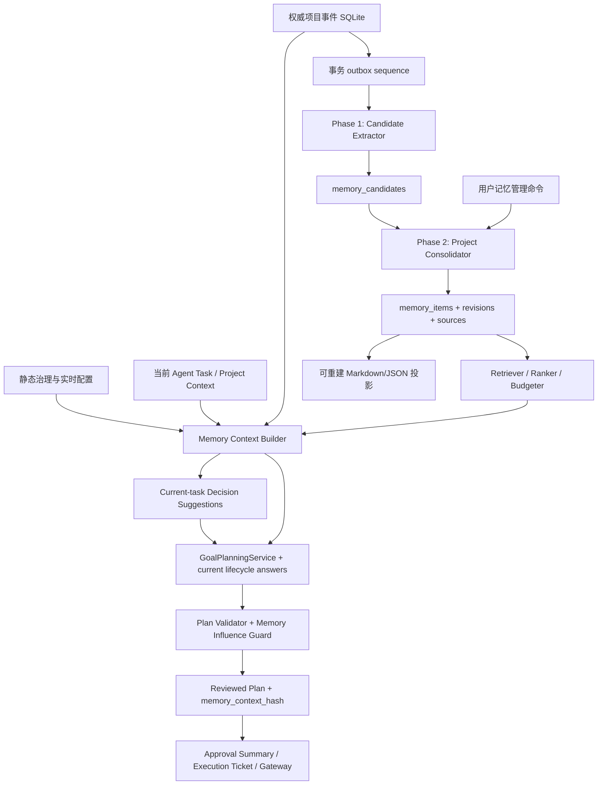
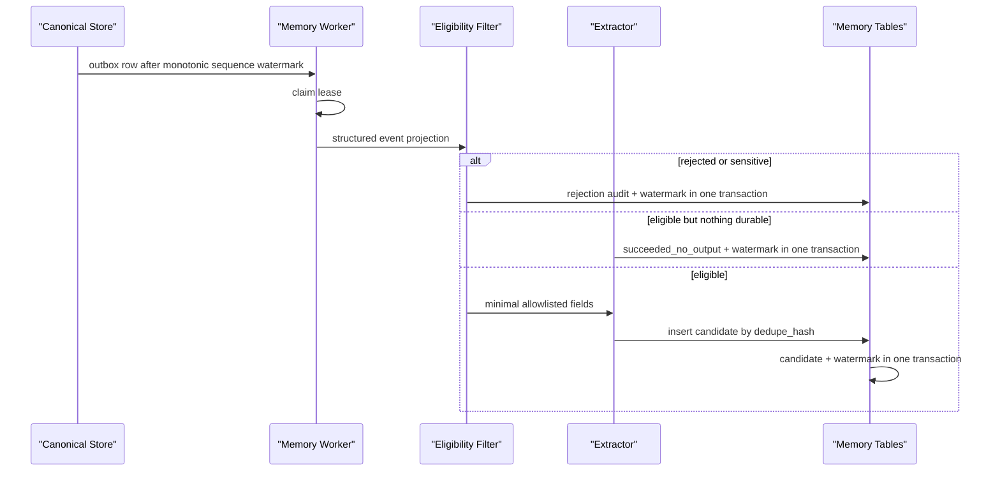

# MedImage Agent 记忆系统设计方案

> 状态：Implemented（2026-07-22，源码与分阶段回归已落地）  
> 任务模式：Architecture / Refactor（Feature Bundle）  
> 适用范围：项目内 Agent 的跨任务记忆、项目经验沉淀、检索注入、审计与遗忘  
> 不改变当前能力等级、Approval Gate、Execution Ticket、Execution Gateway 或科学计算路径

> 调研基线：2026-07-22。事实优先级为“当前仓库源码/测试 > `PROJECT_STATE.md` > OpenAI Codex 当前官方源码说明 > 用户提供 PDF”。PDF 是设计线索，不作为本项目或 Codex 当前实现的唯一事实源。

实现以独立 Memory SQLite、desktop transactional outbox、确定性两阶段管道、
项目授权、来源/版本/事件审计、FTS 检索、`MemoryContext` 计划绑定、科学参数
二次确认、忘记墓碑、可选原子投影、项目设置 UI 和默认关闭的 LLM proposal
服务为主。当前实现不改变任何科学能力等级、执行路径或审批边界；验证结果以
本次任务 Completion Report 和对应自动化测试为准。

> 2026-08-09 收敛说明：`MemoryRetrievalService` 是进入 Agent 规划链的唯一
> typed-context 入口。显式关闭返回 `status=disabled` 且不探测 store；显式启用后，
> memory DB health 或 outbox preflight 失败会结构化阻断规划，不再静默降级为空
> context。可恢复的 outbox lag、retry/dead-letter、过期 lease 和待处理 forget
> 投影为 `partial` warnings。下文第 4 节和第 13 节保留实施前的历史基线与阶段记录，
> 不代表当前运行时仍采用旧 provider、迁移或 fallback。

## 1. 摘要

本方案参考《Codex 的记忆系统》所描述的“静态规则 + 长期记忆”“线程级提取 + 全局整合”“权威数据库 + 可读文件投影”“增量水位 + Selection Diff 遗忘”思路，但不直接复制 Codex 的实现。

MedImage Agent 的核心约束不同：它是受控的 rs-fMRI 研究工程平台，已有项目级 SQLite 状态、Reviewed Plan、审批摘要、执行票据、运行证据、Observation、Goal Evaluation 和恢复记录。记忆系统必须复用这些权威事实，不能成为第二套状态机，也不能把历史经验转化为当前执行权限。

推荐采用以下总体方案：

1. **四层上下文模型**：静态治理、当前工作记忆、权威事件事实、长期学习记忆彼此分离。
2. **两阶段生产管道**：Phase 1 从已提交的结构化事件生成候选记忆；Phase 2 在项目范围内串行整合、冲突检测和遗忘。
3. **独立 SQLite 为权威源**：使用应用 work root 下的独立 memory SQLite；现有 desktop state SQLite 只通过事务 outbox 暴露权威事件。Markdown/JSON 仅作为可重建投影。
4. **默认确定性、LLM 可选**：无 LLM 时仍能完成结构化提取、去重、检索和维护；LLM 只增强摘要与归并，不拥有写入最终记忆的权限。
5. **检索后绑定计划**：真正参与规划的记忆条目、版本和快照 hash 必须写入 Reviewed Plan；记忆变化不能修改已审批计划。
6. **显式遗忘与可审计维护**：支持接受、拒绝、固定、过期、替代和忘记；保留事件审计和最小 tombstone，避免“删除后又被旧事件重新提取”。

## 2. 目标、非目标与成功标准

### 2.1 目标

- 记住用户在当前项目中明确表达且跨任务仍有价值的偏好，例如语言、报告格式和交互习惯。跨项目 profile 记忆在可信身份来源确定前不进入 MVP。
- 记住项目内已经确认的研究决策，例如经用户确认的 atlas、GSR 选择或输出约定，并保持来源可追溯。
- 从终态运行证据中沉淀可复用的工程经验，例如特定环境前提、稳定失败模式和已验证恢复策略。
- 在新 Agent Task 规划前检索少量相关记忆，减少重复提问，同时保持计划确定性和审批边界。
- 允许用户查看、编辑、接受、拒绝、固定和忘记记忆。
- 支持增量处理、重启恢复、并发互斥、版本迁移、容量治理和完整审计。

### 2.2 非目标

- 不保存原始 DICOM、NIfTI、BIDS 文件内容或可识别受试者信息。
- 不保存 API key、token、完整环境变量、完整日志、任意工具输出或绝对 rawdata 路径。
- 不复制可从当前源码、配置、Tool Catalog、能力矩阵或项目状态实时读取的信息。
- 不把记忆作为执行授权、审批、能力等级、科学有效性或临床结论的事实来源。
- 不建立开放式自主循环，不允许记忆自动批准执行、恢复或科学参数。
- 不在用户未启用记忆或项目未授权自动沉淀时后台保存长期记忆。
- MVP 不引入向量数据库或新的必需模型依赖；SQLite FTS5 和确定性排序足够完成首期检索。
- 本文档不授权在 `v0.6.0-rc2` 收敛窗口内新增执行路径或公共能力。

### 2.3 成功标准

- [ ] 相同项目的活跃记忆可在重启后完整读取，不跨项目泄漏。
- [ ] 所有记忆均有来源、版本、状态、作用域、敏感级别和审计事件。
- [ ] 同一来源事件重复处理不产生重复候选或重复活跃记忆。
- [ ] 规划使用的记忆集合有稳定 hash，并绑定到 Reviewed Plan/Approval Summary。
- [ ] 记忆变更不会改变已持久化或已审批的计划。
- [ ] 任何科学参数记忆均不能跳过现有科学决策确认规则。
- [ ] 忘记、过期和替代后的条目不再进入检索结果和 Prompt。
- [ ] 数据库与文件投影不一致时以数据库为准，并可安全重建投影。
- [ ] PHI、秘密、rawdata 路径和大块日志在进入候选表前被拒绝或清洗。

## 3. 参考设计中可借鉴与不可照搬的部分

### 3.1 借鉴点

| 参考文档思路 | 本项目采用方式 |
|---|---|
| 只保存不可推导的信息 | 当前源码、规则、能力和运行状态实时读取；记忆只保存隐式偏好、确认决策和跨任务经验 |
| 静态记忆与长期记忆分层 | `AGENTS.md`/安全规则保持静态治理；新增长期学习记忆，不互相复制 |
| Phase 1 并行提取 | 按 Agent Task、Observation 或终态 run event 生成候选，可跨项目并行 |
| Phase 2 串行整合 | 每个项目同一时刻只允许一个 consolidation lease，避免冲突写入 |
| Watermark 增量处理 | 对每类权威事件流保存最后已处理的事件 ID/hash |
| Selection Diff 遗忘 | 每次整合明确记录 added、retained、superseded、expired、removed |
| State DB + 文件投影 | SQLite 是权威源；Markdown/JSON 用于人工阅读、导出和调试，可随时重建 |
| 粗筛 + 精炼 | 确定性分类/轻量模型生成候选；更强模型仅做可选整合建议 |

### 3.2 不照搬的部分

- Codex 面向编程会话；本项目处理医学影像研究工程，隐私、科学真实性和审批约束更强。
- 不从全部自然语言对话和工具 trace 直接提取。首选已经持久化、结构化且有项目绑定的事件。
- 不把 `AGENTS.md` 内容写入应用记忆；该文件是开发治理规则，不是终端用户偏好。
- 不把 SQLite 记忆库与 Pipeline Runtime 状态混为一体；记忆只消费已提交证据，不成为执行状态权威源。
- 不固定某个供应商或模型名称。可选模型由统一的 `MEDIMAGE_AGENT_MODEL_*` 配置选择，且模型功能默认关闭。
- 不允许模型自行决定高影响记忆生效。科学参数、安全和执行相关候选必须经过显式确认或直接拒绝。

### 3.3 PDF 与 Codex 当前官方实现的差异及本项目取舍

用户提供的 PDF 适合解释生命周期和早期实现思路，但 OpenAI Codex 当前官方仓库已经补充了更精确的运行约束。方案采用以下经过核对的结论：

| 调研事实 | 当前官方证据 | MedImage Agent 取舍 |
|---|---|---|
| Phase 1 只处理满足来源、年龄、空闲时间、claim/lease 和批量上限的 rollout；允许 `succeeded_no_output` 并对失败退避 | [Codex Memories Pipeline README](https://github.com/openai/codex/blob/main/codex-rs/core/src/memories/README.md#phase-1-rollout-extraction-per-thread) | 不扫描全部对话；只消费 consent 生效后的结构化 outbox。无可记内容是成功结果，仍推进 watermark，不能当作错误热循环 |
| Phase 2 当前通过单一全局锁、受限输入集、usage/recency 选择、文件投影和受限 consolidation agent 工作 | [Codex Phase 2 说明](https://github.com/openai/codex/blob/main/codex-rs/core/src/memories/README.md#phase-2-global-consolidation) | 串行粒度改为 project；保留 usage/recency/TTL 思路，但最终动作由确定性 policy + SQLite transaction 决定 |
| 当前 Codex 使用 memories root 的 Git baseline 与 `phase2_workspace_diff.md` 让 consolidation agent 看到增删改，而 PDF 主要描述 Selection Diff | [Codex Memories Pipeline README](https://github.com/openai/codex/blob/main/codex-rs/core/src/memories/README.md#phase-2-global-consolidation) | 应用运行时不引入内部 Git 仓库；等价 diff 持久化在 `memory_consolidation_runs`，文件仍只是可重建投影 |
| 当前配置把生成与使用分开，并提供 external-context 污染控制、age/idle/unused/batch 等有界参数 | [Codex `MemoriesToml` 配置 schema](https://github.com/openai/codex/blob/main/codex-rs/core/config.schema.json) | 分离 `generation` 和 `use` consent；增加 source trust class。外部/不可信上下文默认不自动沉淀，也不能进入 planning context |
| Codex 的内部 consolidation agent 关闭审批、网络和协作，只能在本地 memory workspace 工作 | [Codex Phase 2 说明](https://github.com/openai/codex/blob/main/codex-rs/core/src/memories/README.md#phase-2-global-consolidation) | 本项目 LLM 只返回 schema-validated proposal，不获得文件、网络、Approval Gate、Execution Gateway 或 runner 能力；由服务完成最终提交 |

因此，本方案借鉴的是边界、调度、增量、遗忘和投影模式，而不是 PDF 中的模型名称、固定阈值、文件布局或 Codex 的 Git workspace 实现细节。

## 4. 实施前项目基线（历史）

### 4.1 当时已有基础

| 现状 | 证据 | 可复用价值 |
|---|---|---|
| 已有 `MemoryProvider` Protocol，覆盖 global/project 读写、event、search 和生命周期方法 | `src/backend/app/runtime/memory_provider.py:8-52` | 可作为兼容入口，但接口过于文件导向，需要收敛为领域模型 |
| 默认 provider 是进程级 `FileMemoryProvider` 单例 | `src/backend/app/runtime/memory_store.py:10-25` | 说明已有替换后端的意图；不适合作为生产依赖注入方案 |
| 文件 provider 初始化三个 global Markdown，并在项目访问/append 时懒创建 `PROJECT.md`、`LESSONS.md` 和 `RUN_HISTORY.jsonl` | `src/backend/app/runtime/memory_providers/file_provider.py:34-42,66-70,130-140` | 可迁移为兼容文件投影的命名参考 |
| append event 已删除顶层 `raw_patient_data` 和 `phi` | `src/backend/app/runtime/memory_providers/file_provider.py:66-70` | 提供了最小隐私意识，但远不足以覆盖嵌套 PHI、路径、日志和秘密 |
| `SessionDB` 已有 run/node/error 表、FTS5、WAL 和外键 | `src/backend/app/memory/session_db.py:10-60,66-78` | FTS5 和 SQLite 运维经验可复用 |
| 记忆候选由项目级 `MemoryCandidateService` 生成，且不授予规划或执行权限 | `src/backend/app/services/memory_candidate_service.py` | 与候选记忆、人工确认模型一致 |
| 项目权威 SQLite 已保存 project、Reviewed Plan、run link、ticket、Agent lifecycle、Observation、Goal Evaluation 和 recovery 数据 | `src/backend/app/services/mock_store.py:81-309` | 应作为长期记忆的事实来源与事务宿主 |
| 新 API 已采用薄 Route、Pydantic Schema、Service、Protocol 和 `Depends()` | `src/backend/app/api/agent_task_routes.py:1-103`、`src/backend/app/api/dependencies.py:27-219` | 记忆 API 应遵循同一边界 |
| 当前 planner 已通过 `constraints` 接收 project context，OpenAI-compatible Prompt 也有结构化 constraints 区域 | `src/backend/app/services/goal_planning_service.py:40-56`、`src/backend/app/planner/llm_provider.py:77-111` | 可在 Service 层加入受控 `memory_context`，不需要建立旁路 planner |
| `atomic_write_json()` 已实现 per-path lock、同目录临时文件、flush/fsync 和 `os.replace()` | `src/backend/app/runtime/atomic_file.py:10-57` | `atomic_write_text()` 应复用同一模式，而不是另建不一致的文件写入机制 |
| Observation adapter 已有 secret/path redaction 和 redaction flags | `src/backend/app/services/observation_adapters.py:41,183-190` | 可复用规则词汇与测试 fixture，但 Memory filter 仍需 typed allowlist、PHI/subject/path 专用策略，不能直接把 GUI/Observation 清洗视为完整隐私保证 |

### 4.2 当时确认的缺口

1. **没有真正的长期记忆消费链**：当前 planner、planning service 和 Agent Runtime 没有读取 `MemoryProvider` 的调用；现有 memory 文件不会影响后续规划。
2. **SQLite provider 不是持久化的记忆权威源**：global/project 正文保存在进程内字典，shutdown 会清空；FTS 写入失败被吞掉。见 `sqlite_provider.py:13-14,30-62,114-119`。
3. **文件写入不符合受管状态要求**：正文和历史直接使用 `write_text()`/append，没有原子替换、schema version、并发锁、内容 hash 或 revision。见 `file_provider.py:42,51,62,66-73`。
4. **默认路径和项目作用域不统一**：一部分使用仓库根 `memory/`，另一部分使用 `outputs/memory/`；项目身份使用可碰撞的名称清洗，而不是稳定 `project_id`。
5. **隐私清洗过弱**：只删除两个顶层字段，嵌套字段、DICOM 标识、受试者 ID、绝对路径、Prompt 注入文本和秘密仍可能进入存储。
6. **检索语义不足**：文件 provider 只搜索 `RUN_HISTORY.jsonl`；SQLite FTS 没有版本、作用域、状态、过期和来源过滤。
7. **遗忘和冲突治理不存在**：没有 active/superseded/rejected/expired/tombstoned 状态，也没有 Selection Diff 或用户忘记命令。
8. **API 与存储实现已漂移**：`session_routes.py:55,65` 调用 `SessionDB.query_nodes()` 和 `fts_search()`，而当前实现提供的是 `query_nodes_by_run()` 和 `search()`（`session_db.py:180,204`）。这说明旧 session memory 表面不应直接扩张。
9. **异常被静默吞掉**：SQLite provider 多处 `except Exception: pass`，无法满足审计和失败可观测性要求。
10. **当前工作树存在大量用户改动**：后续实现必须以单一所有者维护一致 diff，不得把记忆重构混入正在收敛的 Agent-first/RC2 工作。

### 4.3 当时的设计结论

当时的代码只能视为记忆骨架。实施后的 L3 长期记忆已经以独立 memory SQLite
为唯一权威源，并由 desktop transactional outbox 输入结构化事实。旧
`memory_store.py`、`SessionDB` 和 `/api/sessions/*` 仍属于独立的 background-review
或 operational run-history 表面，不是 L3 Memory Domain 的读取、规划或权限来源。

## 5. 记忆分类与边界

### 5.1 四层上下文模型

| 层 | 内容 | 权威来源 | 是否进入长期记忆 |
|---|---|---|---|
| L0 静态治理 | `AGENTS.md`、安全边界、能力矩阵、Tool Catalog、配置规则 | 当前文件/代码/配置 | 否；每次实时读取 |
| L1 当前工作记忆 | 当前 goal、待回答 science decision、Reviewed Plan、Approval Summary、任务状态 | Agent lifecycle/read model | 否；生命周期结束后只作为候选来源 |
| L2 权威事件事实 | run link、ticket、artifact、Observation、Goal Evaluation、recovery 事件 | project SQLite + runtime artifacts | 否；保持原表，仅保存引用 |
| L3 长期学习记忆 | 用户偏好、确认决策、环境事实、工程经验 | 新 Memory Domain | 是；带来源、版本和状态 |

这一区分防止把事实复制成容易过期的摘要，也防止长期记忆成为第二套状态机。

### 5.2 允许的记忆类型

| kind | 示例 | 默认作用域 | 生效规则 |
|---|---|---|---|
| `user_preference` | 中文回答、报告偏好、是否展示高级证据 | project | 用户显式声明可直接 active；系统推断需确认 |
| `project_decision` | 项目 atlas、GSR、template、输出命名约定 | project | 必须来自显式用户决定；科学项默认每次可复核 |
| `environment_fact` | 已确认某依赖不可用、特定 backend 已验证 | project（附 machine fingerprint 适用条件） | 必须带检测证据和 TTL；实时健康检查优先 |
| `workflow_lesson` | 某前提缺失时应先补充输入；某恢复方式曾成功 | project | 必须引用 Observation/Goal Evaluation；仅作建议 |
| `error_lesson` | 可复现错误分类及已验证修复 | project | 需要重复证据或人工接受；不能自动改 error KB |
| `presentation_preference` | 表格列、默认展开层级 | project | 低风险，可直接影响 UI，不影响执行 |

### 5.3 永不记忆或只保存引用的内容

- rawdata、DICOM tag 全量、NIfTI 数值、图像缩略图、受试者级自由文本。
- PatientName、PatientID、BirthDate、AccessionNumber、InstitutionName 等潜在 PHI。
- API key、Authorization header、完整环境变量、cookie、token、私钥。
- 完整 stdout/stderr、异常堆栈、工具 trace、模型原始响应；只保存经分类后的短摘要和源 artifact ID。
- 绝对用户路径；最多保存项目相对逻辑路径或 artifact/run/lifecycle ID。
- `AGENTS.md`、Skill payload、System Prompt、Tool Catalog、能力矩阵和源码路径清单。
- 未经校验的模型陈述、临床结论、诊断推断、患者级结论。
- 审批状态和执行权限的“记忆副本”；这些始终从当前权威表读取。

## 6. 目标架构



### 6.1 组件职责

| 组件 | 建议位置 | 职责 |
|---|---|---|
| Memory schemas | `src/backend/app/schemas/memory.py` | 请求/响应、候选、条目、revision、source、event、context contract |
| Memory store protocol | `src/backend/app/api/memory_dependencies.py` 或 `api/dependencies.py` 中独立 Protocol | 隔离存储；读接口经 `Depends()` 注入 |
| SQLite repository | `src/backend/app/services/memory_repository.py`，使用 ConfigService 提供的独立 memory DB path | 持久化、幂等命令、lease、watermark、FTS、revision 和审计；memory 故障不污染 desktop state DB |
| Source outbox | desktop state SQLite 中的 append-only `memory_source_outbox` | consent 生效时与 lifecycle/observation/evaluation 等源 mutation 同事务写入单调 sequence 和 source ref/hash，不复制敏感正文 |
| Control ledgers | desktop state SQLite 中的 forget/consent ledgers | 在独立 memory DB 恢复、禁用或回滚时仍提供删除 epoch 与授权 sequence fence |
| Eligibility/filter | `src/backend/app/services/memory_filter_service.py` | 作用域、分类、PHI/secret/path/Prompt injection 拒绝与清洗 |
| Candidate extractor | `src/backend/app/services/memory_candidate_service.py` | 从已提交结构化事件生成候选；确定性优先，LLM 可选 |
| Consolidator | `src/backend/app/services/memory_consolidation_service.py` | 每项目串行 Selection Diff、冲突、替代、过期和 tombstone |
| Retriever | `src/backend/app/services/memory_retrieval_service.py` | FTS/标签检索、确定性排序、token/byte budget、来源投影 |
| Context builder | `src/backend/app/services/memory_retrieval_service.py` | 唯一 typed context 入口；完成 gate/health/outbox preflight、预算、science decision suggestions、来源 refs、warnings 与稳定 hash；不拼接自由文本 Prompt |
| Scientific parameter registry | `src/backend/app/planner/scientific_parameter_registry.py`（并由 Node Contract/参数 schema 引用） | 对每个可执行 node 参数分类 scientific/safety/operational，声明允许 provenance 和 confirmation policy；未知参数 fail closed |
| Projection sync | `src/backend/app/services/memory_projection_service.py` | 从 DB 原子重建 Markdown/JSON，校验 manifest/checksum |
| Domain router | `src/backend/app/api/memory_routes.py` | 薄 HTTP adapter、结构化错误、命令幂等、分页 |
| Frontend feature | `src/frontend/src/features/memory/` | 查看、筛选、接受、拒绝、编辑、固定、忘记、显示计划使用记录 |

### 6.2 唯一所有者原则

- SQLite Memory Domain 是 L3 的唯一权威源。
- Observation、Goal Evaluation、Reviewed Plan 等仍由各自现有表拥有，memory 只保存 `source_type + source_id + source_hash`。
- Markdown/JSON 是 projection，不可被运行时反向当作权限或事实来源。
- `MemoryRetrievalService` 是进入任务决策/规划链的唯一入口；其他 Service 不直接拼接 memory 文本。scientific memory 只进入当前任务 decision suggestion，不进入 planner 自由文本 constraints。
- Route 不直接访问 SQLite，不直接调用模型，不执行后台整合。

## 7. 数据模型

### 7.1 核心表

#### `memory_candidates`

保存 Phase 1 输出，尚未成为长期记忆。

| 字段 | 含义 |
|---|---|
| `candidate_id` | UUID |
| `project_id` | MVP 唯一作用域；必须绑定现有项目 |
| `scope_type` | MVP 固定为 `project`；profile scope 待可信身份来源确定后另行设计 |
| `source_trust_class` | `explicit_user`、`authoritative_structured`、`external_untrusted`；第三类禁止自动 active，MVP 默认直接拒绝自动沉淀 |
| `kind` / `canonical_key` | 类型和稳定去重 key |
| `content_json` / `content_text` | 结构化内容与可读摘要 |
| `impact_class` | `presentation`、`workflow`、`scientific`、`safety` |
| `source_type` / `source_id` / `source_hash` | 来源绑定 |
| `consent_epoch` | 产生该 candidate 的 desktop 权威 consent 版本 |
| `extractor` / `model` / `prompt_version` | 生产者与版本；确定性提取时 model 为空 |
| `confidence` | 0..1，仅作排序依据，不代表科学置信度 |
| `sensitivity` | `public`、`project_internal`、`restricted`、`rejected` |
| `status` | `proposed`、`accepted`、`rejected`、`expired`、`suppressed`；无候选产出的 job outcome 另记 `succeeded_no_output` |
| `requires_review` / `rejection_code` | 审核与拒绝原因 |
| `dedupe_hash` | 幂等唯一键 |
| `candidate_version` | 乐观并发整数；accept/reject/edit 必须携带 expected value |
| `created_at` / `expires_at` | 生命周期 |

#### `memory_items`

保存当前逻辑条目，不覆盖历史版本。

| 字段 | 含义 |
|---|---|
| `memory_id` | 稳定逻辑 ID |
| `project_id` | MVP 唯一作用域 |
| `kind` / `canonical_key` | 同一作用域内的语义 key |
| `current_revision_id` | 当前版本 |
| `item_version` | 乐观并发整数；pin/forget/restore 等 metadata mutation 必须携带 expected value |
| `status` | `active`、`expired`、`forgotten`、`conflicted`、`merged`；旧 revision 才标记 superseded |
| `pinned` | 用户固定；自动整合不得删除 |
| `superseded_by_memory_id` | 仅两个逻辑 item 合并时使用；普通值更新不创建第二个 item |
| `valid_from` / `valid_until` | 时间有效性 |
| `created_by` / `created_at` / `updated_at` | 审计摘要 |

#### `memory_revisions`

保存内容不可变版本：正文、结构化值、content hash、impact、置信度、确认状态、模型元数据和变更原因。同一 project/canonical key 的值更新沿用 `memory_id` 并创建新 revision；旧 revision 的 supersession 通过 item 指针、append-only relation/event 表达，不修改 revision 内容行。scientific revision 强制包含 `algorithm_id`、`algorithm_version`、`config_fingerprint`、`applicability` 和 `confirmation_event_id`。隐私 forget 是唯一例外：所有相关 revision 的正文会被不可逆清空，只保留 hash 和最小审计元数据。

#### `memory_sources`

多对多关联 memory revision 与原始权威记录。删除或清理源 artifact 时仍保留最小的 source ID/hash，不复制原始内容。

#### `memory_events`

不可变审计账本。事件包括 `candidate_created`、`accepted`、`edited`、`pinned`、`unpinned`、`superseded`、`expired`、`forgotten`、`restored`、`projection_rebuilt`。所有 mutation 带唯一 `command_id`、服务端 principal、前后 revision hash。

#### `memory_commands`

保存 mutation 幂等账本：`command_id`、可信 principal、action、project/target、canonical payload hash、结果 item/revision/event IDs 和完成时间。相同 `command_id + payload_hash` 重放返回原结果；相同 command ID 携带不同 payload 时返回结构化冲突。

#### `memory_tombstones`

保存 project ID、canonical key、semantic fingerprint、source-lineage fingerprints、旧 content hash、forget policy version/generation、principal 和时间，不保存 plaintext。它是防止旧 outbox/source 重放自动复活的权威索引；恢复只能由用户显式命令触发。

规范化和匹配规则：

- canonical key 是 `kind + ":" + Unicode NFC(trim(key)).casefold()`；key schema version 必须入库。
- semantic fingerprint 是 typed value 的 canonical JSON + kind/policy version 的稳定 hash。
- source-lineage fingerprint 是 project/source type/source ID 的稳定 hash，不包含可变化的 source content hash。
- tombstone 还保存 `forget_outbox_sequence`。未 restore 时，同 canonical key 的自动候选默认抑制；已 restore 后，旧 tombstone 仅抑制 `source_sequence <= forget_outbox_sequence` 或更早 generation 的输入。
- 显式 restore 创建 `generation = forgotten_generation + 1` 的新 revision，并记录 `restored_from_tombstone_id`；同 source lineage 且 sequence 更新的后续候选可以进入 review，但不能自动 active。

#### `memory_forget_ledger` 与 `memory_consent_ledger`（位于 desktop state SQLite）

- forget ledger 是跨 memory DB 备份世代的最小权威删除账本，字段与 tombstone 的无 plaintext 匹配字段一致，并带单调 `forget_epoch`。
- forget saga 先提交 desktop ledger，再清空 memory DB plaintext/FTS/projection；两步之间崩溃时，所有读取先 JOIN/check ledger 并 fail closed，reconcile 完成清空。
- memory 备份 manifest 记录 `forget_epoch`，但同一备份集内的 ledger 不能证明自己是全局最新。在线恢复只有在能从未随该备份回滚的独立 deletion authority 取得 current epoch 时才可复用旧 memory DB。若恢复的是整个本地状态集合、无法证明 current epoch，默认必须隔离并销毁恢复出的 memory DB、创建空库；不得让用户“确认风险后继续使用”旧记忆。独立 deletion authority 属于后续治理/运维能力，未实现前采用空库恢复策略。
- consent ledger 记录 enable/disable command、principal、project、outbox cutoff sequence 和是否显式授权历史 backfill。consent 关闭时 source mutation 不写 memory outbox。首次启用和重新启用从新的 consent epoch 开始，不追溯未授权期间；只有独立审计命令可对 canonical tables 执行历史 backfill。

#### `memory_source_outbox`（位于 desktop state SQLite）

源 lifecycle/observation/evaluation/run-link mutation 在同一事务中追加 outbox row：单调 `sequence`、project ID、source type/ID/hash、occurred_at。outbox 不保存记忆正文或敏感 payload。memory worker 按 sequence 读取并通过 ProjectStore 获取 allowlisted source projection，从而消除“源已提交但 job 尚未创建”导致的永久遗漏。

#### `memory_jobs` 与 `memory_watermarks`

- outbox row、job、candidate、watermark 和 consolidation run 都携带 `consent_epoch`。job 另保存 `job_type`、project ID、status、lease owner/expiry、单调递增 fencing token、attempt、last_error 和退避时间。
- job、consolidation run 和审计事件只保存 IDs、hash、状态和短错误码，不缓存 candidate/revision plaintext 或模型原始输出。
- watermark 按 `consumer + project_id` 保存最后成功提交的 outbox sequence/hash。
- Phase 1 可跨 project 并行；Phase 2 对同一 project 使用唯一活跃 lease。

#### `memory_consolidation_runs`

记录每次 Selection Diff：input watermark、candidate IDs、added、retained、superseded、expired、removed、模型/规则版本、输出 hash 和失败信息。

### 7.2 约束和索引

- 同一 scope/key 只能有一个 active item；通过事务和 `CREATE UNIQUE INDEX ... WHERE status = 'active'` 的 partial unique index 实现。
- `dedupe_hash` 必须包含 project ID、source type/ID/hash、extractor/policy version 和 canonical candidate payload；对应 unique index 保证作用域内幂等，不得按相同正文跨项目去重。
- 所有 project-scoped 查询必须显式带 `project_id`；禁止先查询再在 Python 过滤。
- FTS 表只索引 active、非 restricted、非 expired 的 revision；接受、替代、过期和忘记在同一 memory DB 事务中同步 FTS。每次检索仍必须把 FTS hit JOIN 回权威 item/revision 表并重新执行 project/status/expiry/sensitivity 过滤。
- revision 与 event 默认只追加；隐私 forget 会清空 revision plaintext、删除 FTS/projection 内容并写最小 tombstone，保留原 content hash 供审计和防复活。
- `store_meta` 记录 memory schema version；启动只接受当前权威 schema，缺失或不一致
  时返回结构化 health failure，不读取旧格式、不迁移、不启用兼容模式。
- `memory_context_hash` 复用 `planner.audit_record.stable_hash()`。所有时间先规范化为 UTC ISO 8601 字符串。hash payload 是完整 `MemoryContext` 去掉 `context_hash` 后的对象：`decision_suggestions` 按 `(decision_kind, memory_id, revision_hash)` 排序，`evidence_refs` 按 `(kind, memory_id, revision_hash, source_ref)` 排序，`planner_constraints` 使用 canonical JSON key 顺序；payload 必须包含 schema version、retrieval policy version、project ID、`status`、`omitted_count`、`used_bytes` 和有序 `warning_codes`，明确排除数据库 rowid 和未规范化运行时对象。

### 7.3 文件投影

建议投影到受批准的 runtime work root，而不是仓库根的 tracked `memory/`：

```text
<project_work_root>/memory/
  manifest.json                    # _schema_version、db revision、checksums
  MEMORY.md                        # 活跃记忆摘要
  CANDIDATES.md                    # 待审核候选摘要
  rollout_summaries/
    <lifecycle_id>.md              # 可选的任务摘要投影
```

规则：

- 投影只包含已清洗内容和逻辑 ID，不包含绝对 rawdata 路径。
- MVP 不生成 profile/global 文件投影；未来必须先有可信 principal 和唯一应用级安全根。
- `manifest.json` 使用 `atomic_write_json()` 并携带 `_schema_version`。
- 新增 `atomic_write_text()`，复用 `atomic_file.py` 的同目录临时文件、flush、fsync、`os.replace()` 和 per-path lock 模式。
- 同步先写内容，再写 manifest；读取时 checksum 不一致即忽略投影并从 DB 重建。
- DB 事务提交成功但 projection 失败时，记忆仍成功；记录可重试错误，不回滚权威数据。
- 自动 projection 默认关闭。实施前必须由治理决策明确“受管内部状态写入”是否为 Approval Gate 的正式例外并同步安全文档；否则只允许用户显式批准的导出，不能静默后台写 Markdown。

## 8. 产生、整合与维护流程

### 8.1 入口门控

只有满足以下条件才调度自动记忆任务：

- `MEDIMAGE_MEMORY_ENABLED=true` 是安装级总门，默认关闭；关闭时 domain router 只返回结构化 disabled 状态，后台 worker 不启动。
- 生成与使用分离：`MEDIMAGE_MEMORY_GENERATION_ENABLED` 控制是否产生候选，`MEDIMAGE_MEMORY_USE_ENABLED` 控制是否检索并影响当前任务。两者仍受项目 consent ledger 约束，任一关闭都不能被另一项或旧审批隐式打开。
- 本地 UI 只能管理项目级 `generate_enabled/use_enabled` consent；安装级环境门只读展示。关闭 generation 后不再产生新候选；关闭 use 后不向 Agent Task 提供 memory context。无论哪项关闭，用户仍可查看、导出或显式忘记已有条目。
- 当前 consent epoch 已生效，consumer watermark 不早于该 epoch 的 outbox cutoff。disable 会在 desktop DB 事务中提交更高且 `enabled=false` 的 epoch，之后的 source mutation 不写 memory outbox；重新启用创建新 epoch，历史 backfill 必须由独立显式命令授权。
- 跨库无法原子撤销已在运行的 worker，因此最终 candidate/consolidation commit 必须携带读取时的 epoch。所有 retrieval、activation、projection/export 在使用 memory DB 前都重新读取 desktop consent ledger；旧 epoch 或 disabled 状态一律 fail closed。reconcile 会清空 disable 后迟到提交的 candidate plaintext。这里承诺的是“disable 后不激活、不消费、不长期保留迟到候选”，而不是不存在瞬时跨库写入窗口。
- 使用非测试、非临时的持久项目 store。
- 来源记录已经事务提交，并属于已存在项目。
- 来源类型在 allowlist 中；首期只允许 Agent lifecycle decision、Observation、Goal Evaluation、终态 run summary 和显式 remember 命令。
- 每个来源必须有 `source_trust_class`。`external_untrusted`（导入文档自由文本、外部工具输出、网页内容、模型原始回答等）在 MVP 不进入自动候选；后续若开放只能形成待审核 candidate，不能直达 active 或 planner。
- 内容先通过大小、敏感信息、路径和类型过滤。
- LLM 提取另受 `MEDIMAGE_MEMORY_LLM_EXTRACTION_ENABLED` 控制；缺少模型配置时退化到确定性提取，而不是任务失败。

建议配置 contract（均进入 `ConfigService`/Pydantic schema，不在各服务直接读取环境变量）：

| 配置 | 默认 | 作用 |
|---|---|---|
| `MEDIMAGE_MEMORY_ENABLED` | `false` | 安装级 Memory Domain 总门 |
| `MEDIMAGE_MEMORY_GENERATION_ENABLED` | `false` | 允许 worker 从授权 outbox 生成候选 |
| `MEDIMAGE_MEMORY_USE_ENABLED` | `false` | 允许 Agent Task 构建只读 `MemoryContext` |
| `MEDIMAGE_MEMORY_LLM_EXTRACTION_ENABLED` | `false` | 允许可选 LLM 生成 proposed candidate |
| `MEDIMAGE_MEMORY_LLM_CONSOLIDATION_ENABLED` | `false` | 允许可选 LLM 生成 consolidation proposal |
| `MEDIMAGE_MEMORY_PROJECTION_ENABLED` | `false` | 仅在治理批准后允许自动文件投影 |
| `MEDIMAGE_MEMORY_STORE_PATH` | desktop store 同级 `memory_state.sqlite` | 独立 DB；resolve 后必须位于应用批准的内部 state/work root |
| `MEDIMAGE_MEMORY_MAX_CONTEXT_BYTES` | 实施时以测试确定 | `MemoryContext` 硬预算；非法值 fail closed 到安全默认值 |

### 8.2 Phase 1：候选提取



确定性提取示例：

- 已回答的 `science decision` -> `project_decision` candidate，标记 `requires_review=true` 或记录已由哪个 decision event 明确确认。
- 终态 Observation + Goal Evaluation -> workflow lesson candidate，仅保存结果分类、warning/error code 和 evidence IDs。
- 自动来源始终先生成 candidate。用户显式“以后默认用中文”不经过后台提取器，而是走 `remember` 命令：低风险 preference 经校验可直接 active，高影响内容仍进入 review。

禁止从 GET projection、未提交状态、原始模型输出、完整日志或失败的部分写入中提取。

过滤后没有值得记忆的内容属于正常的 `succeeded_no_output`；它必须记录 policy version、source ref/hash 和计数后推进 watermark。只有可重试基础设施失败才保留 sequence 等待退避重试，永久不合格输入则记录拒绝并推进，避免 poison event 阻塞整个项目。

可靠摄取依赖 desktop state SQLite 的事务 outbox。consent 生效时，每个允许的 source mutation 与 outbox row 同事务提交；worker 按单调 sequence 拉取，再通过 ProjectStore 读取 typed allowlist projection。memory DB 内无论候选被接受还是因敏感/不合格被拒绝，都必须在同一事务中记录结果并推进 watermark。重复扫描由 project-bound `dedupe_hash` 消除；source 更新必须追加新的 outbox sequence/source hash，不能原地覆盖后假设 worker 会发现。

outbox 应优先引用不可变 event/revision。若只能引用可变 source row，worker 读取后必须重算 source hash：与 outbox hash 不一致时记录 `SOURCE_VERSION_STALE` 并推进该 sequence，不能用新内容冒充旧事件；更新后的 source 必须由更高 sequence row 处理。sequence 因事务回滚出现空号是正常现象，不能仅凭数字不连续判断 gap。

需要全量 backfill 时，在 desktop DB 一个一致性读事务中先记录上界 `S = MAX(outbox.sequence)`，再枚举 allowlisted canonical rows 及其 source hash；以 `backfill:type:id:hash` 形成 project-bound dedupe input，提交 backfill 后把 consumer watermark 对齐到 `S`，随后只消费 `sequence > S`。backfill 与在线消费不能并发写同一 project consolidation generation。

### 8.3 Phase 2：项目级整合

每次整合在一个项目 lease 下完成：

1. 读取上次 consolidation watermark 之后的新候选、当前 active items 和 tombstones。
2. 按 `canonical_key + project_id` 做确定性去重，并检查 canonical key、semantic fingerprint 和 source-lineage fingerprint 是否命中 tombstone。
3. 检测冲突：值不同、来源证据互斥、环境事实过期、用户明确更改偏好。
4. 应用优先级：当前显式用户命令 > 已确认项目 decision > 新且可验证证据 > 系统推断。
5. 生成 Selection Diff：`added`、`retained`、`superseded`、`expired`、`removed`、`needs_review`。
6. 在一个 SQLite 事务中写 revision、item 状态、events、consolidation run 和 watermark。
7. 若治理策略允许自动 projection，则在事务后异步重建；否则仅记录 projection pending，等待用户批准导出。

LLM 可以提出合并摘要或冲突解释，但最终动作必须经过确定性 policy 检查。模型不得激活 `scientific`/`safety` 类候选，不得覆盖 pinned 条目，不得撤销 tombstone。

Lease claim 使用 SQLite `BEGIN IMMEDIATE` 下的条件更新/插入并递增 fencing token；heartbeat 使用数据库 UTC 时间续租。每次提交 consolidation 结果前必须再次校验 owner、未过期 lease 和 fencing token。旧 worker 恢复后不能以陈旧 token 提交。长时间模型调用在事务外完成，最终短事务还要校验输入 revision/version 未变化。

worker 在最终提交前重读 desktop consent epoch；即使 disable 恰好发生在重读之后，迟到记录仍带旧 epoch，后续 activation/retrieval/projection 的权威 fence 会阻断并由 reconcile scrub。不得仅依赖 best-effort lease 撤销。

### 8.4 遗忘、过期与删除

- **显式忘记**：用户命令先向 desktop `memory_forget_ledger` 写入 forget epoch，再在 memory DB 将 item 标记 `forgotten`，清空该 memory ID 的全部 current/superseded revision、关联 candidates 及任何派生摘要 plaintext，删除 FTS/projection 内容并写同 generation tombstone。jobs/consolidation/events 按契约本就不得保存正文。任何读取都先检查 ledger；saga 未完成时 fail closed。
- **自动过期**：environment fact 和临时 workflow lesson 到 `valid_until` 后变为 `expired`。
- **替代**：同一逻辑 item 创建新 revision，旧 revision 标为 `superseded`；只有合并两个逻辑 item 时才使用 `superseded_by_memory_id`。
- **固定**：pinned 条目只能由用户命令修改或忘记。
- **候选清理**：rejected/expired candidates 按 retention policy 清理正文，但保留 dedupe hash、状态和审计事件。
- **防复活**：自动提取或 watermark 重放按规范化匹配规则命中当前 generation tombstone 时只写 suppressed event。用户若要恢复，必须通过显式 `restore` 命令重新提供内容并创建更高 generation revision，原 tombstone 仍保留。
- **物理删除边界**：memory DB 启用 `PRAGMA secure_delete=ON`；forget 后执行 WAL checkpoint，并由受控维护任务对页/freelist 做 `VACUUM`/page rewrite。验证需要对隔离测试 DB/WAL/SHM 做原始敏感字符串扫描。无法承诺从历史离线备份、SSD 介质或已经外发的导出中物理擦除；无法从独立 deletion authority 证明 current epoch 的整集恢复必须丢弃旧 memory DB 并空库重建。

## 9. 检索、Prompt 注入与计划绑定

### 9.1 检索策略

输入为 `project_id + goal + AgentTask state`，输出结构化 `MemoryContext`。首期使用：

1. scope/status/expiry/sensitivity 的 SQL 前置过滤；
2. canonical key/tag 精确匹配；
3. SQLite FTS5 关键词匹配；
4. 确定性排序：pinned > explicit > evidence strength > relevance > recency；
5. 按每类和总 token/byte budget 截断；
6. 去重并附带 `memory_id`、revision hash、source refs、impact class。

不在 MVP 引入 embedding，原因是当前 RC2 依赖冻结、项目语料规模小、FTS 可解释且更容易审计。后续若引入向量检索，也只能作为召回层，最终过滤和排序仍由确定性 policy 完成。

任何 FTS hit 都必须 JOIN 回权威 item/revision 并再次过滤。source ref 无法解析或 source hash 与当前权威记录不符时标记 `source_stale`：scientific/workflow/environment 条目立即排除并进入复核；显式 user/presentation preference 可继续使用，但 UI/context 必须显示 provenance warning。

### 9.2 `MemoryContext` contract

```json
{
  "_schema_version": "memory-context-v1",
  "retrieval_policy_version": "memory-retrieval-v1",
  "project_id": "project-id",
  "status": "enabled",
  "planner_constraints": {},
  "decision_suggestions": [
    {
      "memory_id": "uuid",
      "revision_hash": "sha256",
      "decision_kind": "atlas",
      "typed_value": {"atlas_id": "registered-atlas-id"},
      "algorithm_id": "functional_connectivity",
      "algorithm_version": "version-string",
      "config_fingerprint": "sha256",
      "applicability": {"project_id": "project-id"},
      "confirmation_event_id": "historical-event-id",
      "source_refs": ["agent_lifecycle_event:event-id"],
      "advisory_only": true,
      "confirmation_policy": "confirm_each_agent_task"
    }
  ],
  "evidence_refs": [
    {
      "kind": "workflow_lesson",
      "memory_id": "uuid",
      "revision_hash": "sha256",
      "source_ref": "goal_evaluation:record-id"
    }
  ],
  "omitted_count": 0,
  "used_bytes": 512,
  "warning_codes": [],
  "context_hash": "sha256"
}
```

`context_hash` 由去掉 `context_hash` 字段后的规范化对象计算，避免循环定义。MVP 的 `planner_constraints` 固定为空对象；首期记忆只提供当前任务 decision suggestions 和证据展示。未来开放任何低风险字段前，必须先在共享参数 registry 分类并增加 contract tests，仍不允许 scientific/safety 值或任意自由文本。

### 9.3 唯一注入点

- `AgentTaskCommandService` 在调用 planner 前通过 `MemoryRetrievalService` 读取 memory context。显式关闭返回 disabled context；已启用但 store/outbox preflight 不健康时结构化阻断。
- scientific memory **不进入** `openai_compatible` 或 rule-based planner constraints，也不以自由文本 Prompt 形式发送给模型；它只能形成当前 lifecycle 的 typed decision suggestion。
- MVP 对所有 scientific suggestion 使用 `confirm_each_agent_task`。用户在当前 Agent Task 明确回答后，系统才写入当前 lifecycle 的 `science_answers`，再调用 planner。
- `GoalPlanningService` 只接收当前 lifecycle answers、实时 ProjectContext 和低风险 typed `planner_constraints`。记忆不能新增 node、backend、参数名、allowlist 或审批范围。
- planner 返回后运行确定性 `MemoryInfluenceGuard`：它从共享 Scientific Parameter Registry 枚举每个注册可执行 node 的参数分类。scientific/safety 参数必须有当前 lifecycle decision ID 或实时权威 ProjectContext provenance；未知 executable 参数默认按 high-impact 处理并 fail closed。atlas、GSR、TR、template、output conflict 和 experimental backend 是最低覆盖集，不是硬编码的完整列表。
- 指令模式检测、JSON 转义和“不可信”标签只是纵深防御，不是安全边界。真正边界是 typed allowlist、scientific 数据不进 planner、参数级 provenance 和 post-planner guard。

### 9.4 计划与审批绑定

- Reviewed Plan 保存 `memory_context_hash`、有序 `memory_id/revision_hash` refs 和 retrieval policy version。`save_reviewed_plan()` 的身份计算必须把这些字段纳入 canonical plan hash；只塞进 payload 不算完成。
- Approval Summary 显示影响计划的记忆摘要，并包含同一 hash。
- memory 变化后，已保存 Reviewed Plan 不变；若重新规划，即使 node/params 相同，只要 memory snapshot 不同也生成不同 plan hash/Reviewed Plan identity 和新 Approval Summary。SQLite 唯一键、schema 和 read model 使用同一当前格式。
- Execution Ticket v3 同时绑定 Reviewed Plan/plan hash、Approval Summary hash 和 memory context hash；记忆不直接进入 runner，也不扩张 allowlist/write roots。
- 执行时不得重新检索记忆。运行所需参数只来自已审批、已校验的 Reviewed Plan。
- plan-only 仍保持零执行；它可以读取记忆辅助规划，但不会因记忆创建 approval、dry-run、ticket 或 artifact。

## 10. 安全、隐私和科学真实性

### 10.1 影响等级策略

| impact class | 是否可自动激活 | 是否可影响执行 | 处理 |
|---|---|---|---|
| `presentation` | 用户显式声明时可以 | 否 | 可影响 UI/i18n/展示 |
| `workflow` | 仅低风险且证据充分时 | 只能作为建议 | 在计划证据层显示 |
| `scientific` | 否；MVP 每个 Agent Task 都重新确认 | 仅经当前 lifecycle decision + Reviewed Plan + approval | 强制记录 algorithm/config/applicability/confirmation provenance，且不进入 planner Prompt |
| `safety` | 否；通常不进入长期记忆 | 否 | 始终从静态治理、Node Contract、Gate 和实时配置读取 |

### 10.2 数据最小化

- 用 typed allowlist schema 选择字段，默认不接收任意自由文本，而不是先存储后删除 denylist 字段。
- 对仍被允许的短文本和嵌套结构递归扫描秘密、PHI、DICOM 标识、绝对路径和大字符串；检测器只是纵深防御，不能宣称识别所有 PHI。
- 受试者级 ID 默认不进入 L3；确需统计时只存聚合计数和源记录 ID。
- source reference 使用内部 UUID/hash；UI 通过受控 API 展开证据。
- 所有模型调用只发送已经清洗、最小化的结构化投影，并记录 provider/model/prompt version，不记录 API key。外部 provider 还需独立的用户 opt-in 和数据驻留/处理说明；provider 失败只让该 proposal 结构化停止，不切换 provider。关闭 LLM 时确定性候选、整合和检索链本身仍完整。

### 10.3 Prompt injection 与污染防护

- 不从任意 Markdown、日志和外部数据说明直接提取 active memory。
- 候选正文中出现指令性越权模式时标记 `rejected` 或 `requires_review`。
- MemoryContext 使用 typed JSON contract；scientific/safety 值不进入 planner Prompt，自由文本 workflow lesson 首期也不进入参数生成。
- 检索结果不能覆盖 System/Developer/`AGENTS.md` 指令、Tool Catalog 或实时项目上下文。
- 任一 memory 条目不能改变 `requires_approval`、write roots、rawdata 只读、backend availability 或 capability level。

### 10.4 路径与写入

- 所有 runtime projection 路径 resolve 后必须位于配置的 project work root。
- 禁止写入 rawdata、源 BIDS/NIfTI、`src/`、`tests/` 或仓库文档目录。
- 自动投影是否属于 Approval Gate 的“受管内部状态维护”例外必须在实现前完成治理批准并同步 `docs/安全与审批/安全边界.md`；未批准时不得因为它不是 Pipeline node 就绕过审批，只能走用户显式批准的导出。
- 忘记会清空 memory plaintext/FTS/projection，但不得删除源 run、artifact、audit 或研究数据。

## 11. API 与前端设计

### 11.1 后端 API

建议前缀：`/api/projects/{project_id}/memory`。

| 方法 | 路径 | 用途 |
|---|---|---|
| GET | `/items` | 分页读取 active/expired/forgotten/conflicted/merged items |
| GET | `/items/{memory_id}` | 条目、revisions、sources、events |
| GET | `/candidates` | 待审核候选 |
| POST | `/remember` | 用户显式新增；带 `command_id`、kind 和 expected state，不接受客户端自选 profile/global scope |
| POST | `/candidates/{candidate_id}/accept` | 接受/编辑候选 |
| POST | `/candidates/{candidate_id}/reject` | 拒绝候选并记录原因 |
| POST | `/items/{memory_id}/pin` | 提交目标 `pinned: bool`，禁止 toggle 语义 |
| POST | `/items/{memory_id}/forget` | 忘记并写 tombstone |
| POST | `/items/{memory_id}/restore` | 用户重新提供内容并显式恢复，保留 tombstone 审计 |
| GET | `/events` | 游标分页审计事件 |
| POST | `/context-preview` | 只读预览；通过 body 传 lifecycle ID/goal，避免 goal/PHI 进入 URL/access log |
| GET | `/consent` | 只读返回安装级 generation/use availability、项目 consent、`disabled/healthy/partial/failure`、store health、retrieval policy、outbox sequence/lag、retry/dead-letter、lease、pending forget 与最后 WAL truncate 时间 |
| POST | `/consent` | 幂等设置 `generate_enabled` / `use_enabled`；服务端生成新 epoch/cutoff，不接受客户端自填 epoch |

约束：

- 所有 mutation 必须带唯一 `command_id` 并幂等；相同 command ID 不同 payload/principal 必须冲突。candidate accept/reject/edit 使用 `expected_candidate_version + candidate_hash`，item metadata mutation 使用 `expected_item_version`，内容编辑/restore 额外使用 `expected_revision_hash`；创建除外。
- 使用 Pydantic schema 和结构化领域错误；Route 只做 HTTP/Depends/错误映射。
- 所有读操作（包括 read-only `POST /context-preview`）完全无副作用，不触发 extraction、consolidation、projection rebuild 或 reconcile。
- `context-preview` 与 Agent planning 使用同一三态语义：disabled 不探测 store；
  healthy 返回 `enabled` context；运营积压返回 `partial` context；已启用但 store/outbox
  preflight 失败返回结构化错误，不返回伪造的空成功。
- project ID、principal、command ID、candidate/item ID 必须在 Service 层做绑定检查。MVP 是本地单用户：principal 由服务端桌面 session 固定/派生，不信任请求中的任意 `actor`；可信身份体系完成前禁止 profile/global mutation。
- 搜索 limit、offset/cursor 和 query 长度有明确上限。

### 11.2 前端

新增 `features/memory/`，通过 `lib/api/memory.ts` 访问后端；共享类型放 `lib/types/memory.ts`。

最小 UI：

- Agent/项目设置中的“记忆”页签：Active、Needs review、History 三层。
- 只读显示安装级 availability 和后端运营健康；提供项目级“生成记忆”和“使用记忆”两个 consent 开关，明确说明保存/使用范围。关闭时展示已有条目的保留、导出和忘记选择。
- 每条记忆显示类型、作用域、来源、更新时间、是否用于当前计划和影响等级。
- 候选支持接受、编辑后接受、拒绝；科学类候选用明确确认文案。
- active 条目支持固定、取消固定和忘记；忘记对话说明不会删除原始审计/运行证据。
- Plan review 显示“本计划使用的记忆”及 memory context hash。
- Agent technical evidence 显示冻结 snapshot 的 status、used bytes、omitted count、policy、refs 和 warnings；不从当前 store 重新计算历史计划。
- 覆盖 loading、empty、disabled、success、partial、failure；所有用户文案进入 `en`/`zh-CN` i18n。

## 12. 可观测性与运维

### 12.1 指标

- candidates created/rejected/accepted by kind and rejection code；不以正文作 label。
- Phase 1/2 job duration、lease conflict、retry、dead-letter count。
- active/expired/forgotten item count、superseded revision count 和 projection lag。
- retrieval candidate count、selected count、omitted count、budget usage。
- memory context hash mismatch、stale source、cross-project denial、redaction count。

### 12.2 日志与审计

- 结构化日志只记录 IDs、hash、状态、计数和错误码，不记录 memory 正文。
- DB mutation 与 `memory_events` 在同一事务中提交。
- projection 失败、模型失败和过滤拒绝不得静默吞掉；使用结构化错误并保留重试信息。
- 管理性导出必须通过项目安全路径和现有审批策略；默认导出不包含 restricted 内容。

### 12.3 恢复

- 启动时执行一次环境门控、单次有界 reconcile：释放过期 lease、重新排队可重试 job、重建落后 projection。
- 不在 GET 请求中修复状态。
- 独立 memory DB/worker 损坏时进入 memory-disabled/read-only degraded mode，不影响已经提交的核心确定性 pipeline，也不得回退读取过期 projection。desktop state/outbox 属于同一权威事务；其写失败必须使当次 source mutation 明确失败，不能声称 source 已持久化。
- memory DB 可独立备份，但备份默认只用于灾难诊断。若存在未随备份回滚的独立 deletion authority，可校验 current forget epoch 后恢复并按 outbox 对账；否则任何整集/离线恢复都必须隔离并销毁旧 memory DB、创建空库，再由当前 consent 之后的 canonical source 重新产生候选。projection 无需备份，可重建。

## 13. 分阶段实施记录（历史计划）

本节记录 2026-07-22 的实施拆分，用于审计当时的交付路径；当前运行时行为以本文
开头的 2026-08-09 收敛说明、源码、测试和 `PROJECT_STATE.md` 为准。

本次 `/goal` 是该 Memory Domain 的单独实施批准；实现没有新增执行 node、科学
算法、必需模型依赖或能力等级，也没有改变当前 release 版本。

### 13.1 文件级改动矩阵

下表是实施时的最小完整调用链。`CREATE` 表示新领域文件，`MODIFY` 表示必须同步的现有 contract/consumer，`CHARACTERIZE -> DEPRECATE` 表示先固化行为再迁移，不能直接删除。

| 动作 | 文件/目录 | 如何修改与完成标准 |
|---|---|---|
| CREATE | `src/backend/app/schemas/memory.py` | 定义 config status、consent、candidate、item、revision、source、event、command、context preview 和分页 schema；所有 enum/版本字段显式化 |
| CREATE | `src/backend/app/api/memory_dependencies.py` | 定义 `MemoryStore`/read protocol 与 `Depends()` provider；测试用临时 SQLite override，禁止全局可变单例 |
| CREATE | `src/backend/app/api/memory_routes.py` | 实现第 11 节 API；仅做 HTTP、依赖注入和 `raise_api_error()` 映射，不直接 SQL/LLM/文件写入 |
| MODIFY | `src/backend/app/main.py` | 注册 memory domain router；lifespan 仅在配置/consent/store health 通过时启动一个有界 worker/reconcile owner |
| MODIFY | `src/backend/app/core/config_schema.py`、`src/backend/app/core/config.py`、`.env.example` | 增加上述 `MEDIMAGE_MEMORY_*` typed 配置、路径解析与安全默认值；测试 dev/packaged 环境一致性和非法值行为 |
| CREATE | `src/backend/app/services/memory_repository.py` | 独立 SQLite schema/migrations、transaction、FTS、command idempotency、lease/fencing、watermark、revision/event/tombstone 与 health API；所有 project 查询 SQL 前置过滤 |
| MODIFY | `src/backend/app/services/mock_store.py` | 在 desktop state DB 增加 outbox/consent/forget ledgers；把 lifecycle event、observation、goal evaluation、终态 run 等允许来源与 outbox row 放进同一 `_connect()` transaction |
| MODIFY | `src/backend/app/api/dependencies.py` | 扩展 `ProjectStore` Protocol 的 typed source projection、outbox/consent/forget ledger 方法；不能让 memory repository 直接依赖 concrete `mock_store` |
| CREATE | `src/backend/app/services/memory_filter_service.py` | typed allowlist、source trust、size、secret、PHI、subject ID、absolute path 和 instruction-like content policy；输出结构化 rejection code |
| CREATE | `src/backend/app/services/memory_candidate_service.py` | at-least-once outbox consumer、dedupe、`succeeded_no_output`、retry/dead-letter 和 deterministic extractor；可选 LLM 只返回 proposed schema |
| CREATE | `src/backend/app/services/memory_consolidation_service.py` | project lease 下执行冲突/替代/过期/Selection Diff/tombstone policy；模型建议经 policy 重验后才在短事务提交 |
| CREATE | `src/backend/app/services/memory_retrieval_service.py` | 唯一 typed-context 入口；scope/expiry/trust 前置过滤、FTS authoritative re-join、health/outbox preflight、排序/预算和 canonical context hash；只输出 typed suggestions/refs |
| CREATE | `src/backend/app/services/memory_projection_service.py`、`memory_maintenance_service.py` | 治理允许后重建投影；处理 reconcile、lease expiry、projection lag、forget scrub/VACUUM；GET 永不调用这些 mutation |
| MODIFY | `src/backend/app/runtime/atomic_file.py` | 增加复用 `_path_lock()` 的 `atomic_write_text()`；保持同目录 temp、flush/fsync、replace 和失败清理语义 |
| CREATE | `src/backend/app/planner/scientific_parameter_registry.py`、`memory_influence_guard.py` | 为注册可执行 node 参数声明 impact/provenance；未知参数 fail closed；guard 在 planner 后、Reviewed Plan 前执行 |
| MODIFY | `src/backend/app/schemas/agent_lifecycle.py`、`src/backend/app/services/agent_task_command_service.py` | 在 planner 前读取 context，先把 scientific suggestion 转为当前 lifecycle decision；记录 context hash/refs，当前任务确认后才写 `science_answers` |
| MODIFY | `src/backend/app/services/goal_planning_service.py` | 只接收实时 ProjectContext、当前 lifecycle answers 和 registry 明确允许的低风险 typed constraints；不自行查询 memory |
| MODIFY | `src/backend/app/planner/reviewed_plan_store.py`、`src/backend/app/schemas/desktop.py`、`src/backend/app/services/mock_store.py` | `reviewed_plan_identity()` 把 canonical memory snapshot 纳入 plan hash；同步 record schema、SQLite uniqueness 与 snapshot JSON；不保留旧 identity lookup |
| MODIFY | `src/backend/app/schemas/approval_summary.py`、`src/backend/app/services/approval_summary_service.py` | 加入 `memory_context_hash` 和经过清洗的影响摘要；identity hash 与重建校验包含同一 snapshot，不暴露 memory 正文/PHI |
| MODIFY | `src/backend/app/schemas/agent_task.py`、`agent_task_read_model.py` | 投影 consent 状态、decision source、计划使用的 memory refs/hash 和 warning；GET 保持零副作用 |
| CREATE | `src/frontend/src/lib/api/memory.ts`、`src/frontend/src/lib/types/memory.ts`、`src/frontend/src/features/memory/` | 实现 typed client、controller 和管理 UI；状态完全以后端为准 |
| MODIFY | `src/frontend/src/features/workspaces/SettingsEnvironmentWorkspace.tsx` | 接入安装级 availability 与项目 generation/use consent，不把 UI toggle 当作授权成功 |
| MODIFY | `src/frontend/src/features/agent/components/NextActionCard.tsx`、`TaskDetails.tsx` | 展示当前任务需确认的记忆建议、计划 snapshot/hash 和 provenance warning，不解析任意英文摘要 |
| MODIFY | `src/frontend/src/lib/api/index.ts`、`src/frontend/src/i18n/messages/en.ts`、`zh-CN.ts` | 导出 domain client，并补齐双语 loading/empty/disabled/partial/failure/forget 文案 |
| CREATE/MODIFY | `tests/unit/test_memory_*.py`、`tests/api/test_memory_api.py`、Agent Task/approval/reviewed-plan tests、前端 memory/agent/settings tests | 按第 14 节实现 test-hazard mapping；所有数据库和 project roots 使用临时隔离路径 |
| CHARACTERIZE -> DEPRECATE | `runtime/memory_store.py`、`runtime/memory_providers/*`、`memory/session_db.py`、`api/session_routes.py`、`frontend/lib/api/sessionMemory.ts` | 先测试固化旧行为和调用方；旧 run history 迁入 project history，旧 Markdown 只可导入为候选；迁移验证前不删除 tracked fixture/用户数据 |
| MODIFY（实施完成后） | 架构、安全、能力矩阵、开发工作流、README、`.env.example` | 按第 18 节同步；只有真实实现与验证后才改变 capability/state 文案 |

### Phase A：契约和持久化基线

**目标**：建立不接入 planner 的 Memory Domain。

- 创建 `schemas/memory.py`、MemoryStore Protocol、独立 memory SQLite migration，以及 desktop state `memory_source_outbox`、`memory_forget_ledger`、`memory_consent_ledger` migrations。
- 定义 Scientific Parameter Registry contract，并用覆盖测试要求每个注册可执行 node 的每个公共参数都有分类；未知项 fail closed。
- 实现 items/revisions/sources/events/commands/tombstones/candidates/jobs/watermarks/consolidation_runs。
- 用 ConfigService 定义 `MEDIMAGE_MEMORY_STORE_PATH`，默认位于应用 work root；明确 `foreign_keys`、busy timeout、WAL/锁兼容性和多连接测试。memory schema 失败只能禁用 memory，不能阻止 desktop/project store 启动。
- memory 只能在 outbox migration/health preflight 通过后启用。outbox schema/insert 是 ProjectStore 事务完整性的一部分：功能启用后 outbox insert 失败必须让同一 source mutation fail closed 并返回结构化存储错误，不能提交“有源记录、无 outbox”的部分状态。外部 memory worker/memory DB 故障不回滚已经成功提交的 source/outbox。检测到显式 health fault 或 hash audit 不一致时，按已定义的一致性快照协议 backfill。
- 所有 mutation 提供事务、幂等 command、project binding、structured error。
- 增加 `atomic_write_text()` 和 projection manifest contract，但默认不启用后台任务。
- characterization tests 固化现有 `memory_store.py`、`SessionDB` 和 session API 行为，明确兼容/废弃范围。

**Definition of Done**：重启 round-trip、并发冲突、迁移、回滚只读模式、跨项目隔离和审计测试通过。

### Phase B：确定性候选管道

**目标**：不调用 LLM，从显式命令和结构化事件生成候选。

- 实现事务 outbox adapter、typed allowlist projection、PHI/secret/path filter、project-bound dedupe hash、sequence watermark 和 lease/fencing token。
- 首批自动来源：science decision event、Observation、Goal Evaluation、终态 run summary，均只生成 candidate。显式 `remember` 走独立命令事务：低风险 user/presentation preference 经校验后可直接 active；workflow/scientific 内容仍创建待审核 candidate。
- 已移除的文件型 background review/proposed patch 不再被生成或读取；Memory SQLite 与
  desktop outbox/projection 保持各自受控职责，任何投影都不是权威源。

**Definition of Done**：重复事件幂等、失败不越过 watermark、PHI fixture 被拒绝、计划/GET 无副作用。

### Phase C：整合、遗忘与投影

**目标**：实现每项目串行 Selection Diff 和可重建文件投影。

- 冲突、固定、过期、替代、忘记和 tombstone policy。
- consolidation lease、重试、dead letter 和启动有界 reconcile。
- 在治理批准自动投影例外后实现 DB -> Markdown/JSON 原子投影和 checksum 重建；否则只实现经用户批准的 export。

**Definition of Done**：并发整合无双 active key；投影故障不破坏 DB；忘记后不可检索且不会被旧事件复活。

### Phase D：检索与规划集成

**目标**：只读注入 memory context，并绑定 Reviewed Plan。

- 实现 FTS/精确匹配、确定性排序和预算。
- `AgentTaskCommandService` 在 planner 前生成 typed decision suggestions；scientific memory 不进入 planner constraints。
- 当前 lifecycle 确认后才形成 `science_answers`；planner 后由 Memory Influence Guard 校验参数级 provenance。
- 修改 Reviewed Plan identity，使 canonical memory snapshot 真实参与 plan hash；同步 SQLite 唯一键、Approval Summary、read model、当前 Execution Ticket contract 和前端 plan review。
- 回归 atlas、GSR、TR、template、backend、plan-only、approval order、相同 plan/不同 memory snapshot 和 restart projection。

**Definition of Done**：记忆不能新增未注册 node、不能跳过 science decision/approval、不能改变已审批计划。

### Phase E：可选 LLM 提取/整合

**目标**：在确定性安全壳内增强摘要与冲突解释。

- 独立 feature flag、模型配置、prompt version、输入最小化和输出 schema validation。
- 模型失败时该 proposal 结构化停止；确定性管道是独立的默认实现，不作为失败后替换 provider 的 fallback。模型输出只生成 proposed candidate/diff。
- 建立离线 fixture/evaluation，验证污染、过度概括、错误合并和跨项目泄漏。

**Definition of Done**：关闭 LLM 后核心功能完整；LLM 不能直接激活高影响记忆。

### Phase F：前端管理与旧表面收敛

**目标**：提供可解释的用户控制，迁移旧 memory/session 入口。

- 完成 Memory UI、i18n、client/types/tests。
- 修复或下线漂移的 `/api/sessions/*`；run history 能力迁移到现有 project history domain。
- `memory_store.py` 仅保留显式兼容 shim 并设淘汰条件，移除全局 provider swap 的生产使用。
- 清点 tracked `memory/` placeholders 与 `outputs/memory/`，制定非破坏性迁移脚本和回滚。
- 迁移先生成 dry-run 清单和 checksum：空 placeholder 忽略；旧 run/session 记录继续作为事实来源而非直接激活为记忆；旧 Markdown 只能导入为待审核候选；验证完成前不删除旧文件或数据库。

**Definition of Done**：只有一个记忆权威源、一个检索入口、一个管理表面；旧路径全仓搜索无未解释调用方。

## 14. 测试与验证计划

### 14.1 后端测试

| 测试域 | 关键用例 |
|---|---|
| Schema/Repository | independent DB migration failure isolation、round-trip、all-revision/candidate plaintext scrub、secure_delete/VACUUM raw DB-WAL-SHM scan、same command ID different payload/principal、candidate/item/revision race、transaction rollback |
| Scope/Security | cross-project denial、invalid project、generation/use 分离、consent cutoff/re-enable no implicit backfill、actor spoof、path escape、nested PHI、secret、subject ID、prompt injection、external_untrusted source rejection |
| Candidate | transactional outbox、source commit before worker crash、ordered sequence、mutable source hash mismatch、consistent snapshot backfill boundary、dedupe、rejection advances watermark、LLM 关闭时确定性管道完整 |
| Consolidation | atomic claim、heartbeat、stale fencing token、conflict、pinned、Selection Diff、expiry、forget/tombstone、rewind/new extractor no resurrection、explicit restore |
| Retrieval | FTS authoritative re-join、stale FTS after crash、exact key、budget、deterministic order、expired/restricted exclusion、source stale policy |
| Planner | parameter-registry completeness、unknown executable param fail closed、canonical memory context hash、same plan/different snapshot、rule-based isolation、malicious/confirmed/unconfirmed atlas/GSR/TR/template/backend、plan-only zero execution |
| Approval | memory snapshot in Reviewed Plan/summary、stale summary rejection、post-approval memory change isolation |
| Projection | atomic text、manifest schema/checksum、partial failure、DB rebuild、Windows lock handling |
| Recovery | expired lease、bounded startup reconcile、dead letter、memory DB failure isolation、old backup + independent current deletion authority、authority missing forces old DB discard/empty rebuild |
| Compatibility | existing memory provider/session behavior、migration、old path deprecation errors |

建议聚焦命令（实施后按真实文件名调整）：

```powershell
python -m pytest tests/unit/test_memory_* tests/unit/test_agent_task_commands.py tests/unit/test_approval_summary.py --tb=short --basetemp=.pytest_tmp
python -m pytest tests/api/test_memory_api.py tests/unit/test_project_history_*.py --tb=short --basetemp=.pytest_tmp
```

每次 pytest 后遵循仓库规则验证进程退出，并仅安全清理仓库根直接子项 `.pytest_cache/` 与 `.pytest_tmp*`。

### 14.2 前端测试

- API client contract、Memory controller/view、i18n、empty/disabled/partial/failure。
- Plan review 中 memory snapshot 与后端 hash 一致。
- 忘记/接受/拒绝/固定的幂等和错误呈现。

```powershell
npm --prefix src/frontend run format:check
npm --prefix src/frontend run typecheck
npm --prefix src/frontend run test
npm --prefix src/frontend run build
```

### 14.3 性能和容量

- 10k/100k candidates 的 FTS、consolidation 和 projection benchmark。
- Prompt memory budget 上限、最坏候选量和超长多语言文本。
- 多项目并行 Phase 1、同项目 Phase 2 互斥和 Windows WAL/锁冲突。
- 无 LLM、模型超时、SQLite busy、磁盘满、projection 被锁等故障注入。

## 15. 风险与缓解

| H-ID | 风险 | 缓解 | 验证 |
|---|---|---|---|
| H-01 | PHI/秘密进入记忆或外部模型 | typed allowlist projection、默认不接收自由文本、递归检测作纵深防御、外部模型单独 opt-in | 嵌套 PHI/secret/path fixtures |
| H-02 | 记忆绕过 science decision 或 Approval Gate | scientific memory 不进 planner、当前 lifecycle 确认、参数 provenance guard、Reviewed Plan identity/summary hash、runner 不读 memory | atlas/GSR/TR/template/backend + approval/plan-only 回归 |
| H-03 | 复制权威事实导致过期 | 只存 source refs；实时 project/capability/gate 优先 | source stale/removed 测试 |
| H-04 | 并发整合产生两个 active 值或陈旧 worker 覆盖新结果 | project lease、DB time、fencing token、事务、partial unique index | 并发/stale worker consolidation 测试 |
| H-05 | Prompt injection/记忆污染 | 不从任意文本导入、typed values、scientific 不进 planner、参数 provenance guard；指令检测仅作附加信号 | adversarial candidate suite |
| H-06 | 上下文和存储无限增长 | budget、TTL、candidate retention、Selection Diff、projection cleanup | 容量/截断/清理测试 |
| H-07 | DB 与文件投影不一致 | DB authority、atomic writes、manifest checksum、rebuild | partial write/locked file 测试 |
| H-08 | 旧 provider/session API 继续漂移 | characterization、兼容 shim、明确 deprecation、单一 owner | contract 和全仓调用搜索 |
| H-09 | SQLite 写入失败被吞掉 | 结构化异常、审计、retry/dead letter；禁止 catch-all pass | fault injection |
| H-10 | 跨项目泄漏或伪造 actor | SQL 强制 project 条件、服务端 principal、绑定检查、无全局无条件 search | multi-project/actor spoof 测试 |
| H-11 | 记忆变化破坏可复现计划 | snapshot hash、plan immutable、执行时不重新检索 | memory mutation after approval |
| H-12 | 当前 RC2 冻结被无意突破 | 文档先行；代码阶段需单独批准/后续版本 | release checklist 和 diff review |
| H-13 | 未经用户同意后台沉淀长期数据 | 本地设置 + project consent、默认关闭、关闭时停止新候选和投影 | consent lifecycle/API tests |
| H-14 | source 提交后崩溃导致永久漏记或错读新版本 | 与 source mutation 同事务的单调 outbox、hash mismatch 拒绝、at-least-once 消费和 project-bound dedupe | commit-before-worker + mutable-source tests |
| H-15 | forget plaintext 残留在旧 revisions/candidates/FTS/WAL/恢复备份 | desktop forget ledger、全关联 scrub、secure_delete/VACUUM、current deletion authority；无法证明时销毁旧 DB 并空库恢复 | raw DB/WAL/SHM scan + backup/restore tests |
| H-16 | 自动投影绕过文件写审批 | 默认关闭；治理批准并同步安全文档，否则只做审批导出 | gate/feature-flag tests |
| H-17 | 新 scientific 参数未被 guard 覆盖 | 共享参数 registry、每个可执行 node 参数分类、未知项 fail closed | registry completeness test |
| H-18 | 重新启用后追溯未授权事件或 disable 后迟到 worker 提交 | consent epoch 贯穿 outbox/job/candidate/commit，所有消费重查 desktop ledger，旧 epoch fail closed/scrub；历史 backfill 独立授权 | disable race + re-enable sequence fence tests |
| H-19 | 外部/不可信上下文污染长期记忆，后续被当成用户决定或权威证据 | `source_trust_class`、MVP 拒绝 external_untrusted 自动沉淀、typed source projection、generation/use 双门、provenance warning | imported text/model output/web content adversarial tests |
| H-20 | UI 关闭“生成”但仍使用旧记忆，或关闭“使用”却仍在后台沉淀，用户无法理解数据行为 | generation/use 独立 consent、安装级 availability 只读、每次 worker/retrieval 重查 epoch、UI 分别说明和展示 | consent matrix + restart + race tests |

## 16. Proof Obligations

实施审查者必须逐项证明：

| 声明 | 验证方式 |
|---|---|
| 当前权威项目状态已在 SQLite 持久化 | 检查 `mock_store.py` schema、重启 round-trip tests |
| Memory Domain 不复制 run/approval/observation 真值 | 检查表结构只保存 source ref/hash，搜索重复 payload |
| 规划只有一个记忆入口且 scientific 不进 planner | 全仓搜索 `MemoryRetrievalService`/`memory_context` 调用并检查 typed schema/guard |
| 执行链不读取 memory | 搜索 runner/gateway/ticket 模块依赖并运行阻断测试 |
| 所有 mutation 幂等且项目绑定 | command replay 和 cross-project API tests |
| 忘记后不会被旧事件复活 | tombstone + rewind watermark integration test |
| 文件投影可完全从 DB 重建 | 删除隔离测试投影后重建并比较 checksum |
| LLM 关闭时功能仍完整 | 未配置 key/flag 的端到端 memory tests |
| 科学和安全记忆不能自动激活 | policy unit tests + Agent Task decision tests |
| Prompt 预算有硬上限 | 超量数据测试并核对 omitted_count |
| 相同 plan 内容但不同 memory snapshot 有不同 Reviewed Plan identity | plan hash/SQLite uniqueness/Approval Summary contract test |
| source commit 不会因 worker 崩溃永久漏记 | transactional outbox + restart consumer test |
| forget 后全部关联 revisions/candidates/FTS/projection 无 plaintext 且旧事件/旧备份不复活 | raw DB/WAL/SHM scan、rewind/new extractor、current-authority restore 与 authority-missing empty-rebuild tests |
| 每个可执行 node 参数都被 impact registry 分类 | registry completeness test，未知参数必须使 guard fail closed |
| consent 关闭期间的 outbox 不会被重新启用自动追溯 | consent epoch/cutoff/re-enable integration test |
| external/untrusted 内容不会自动成为长期记忆或规划证据 | source trust policy tests + outbox/candidate/context integration test |
| generation/use 两个开关互不隐式开启，且重启后保持一致 | consent matrix、restart projection 和 disabled-mode API tests |

## 17. 假设与待决策项

### 17.1 已采用假设

| A-ID | 假设 | 分类 | 依据 | 错误后影响 |
|---|---|---|---|---|
| A-01 | 首期使用独立 memory SQLite，并在 desktop state SQLite 增加事务 outbox | 设计决策 | 隔离 memory migration/损坏，同时不丢失源提交事件 | 增加双库运维和 outbox 对账成本 |
| A-02 | FTS5 足以满足 MVP | 设计决策 | 当前 `SessionDB` 已使用 FTS5；依赖冻结且语料规模有限 | 后续增加 embedding 召回层 |
| A-03 | 自动记忆从结构化终态事件开始，不扫描全部对话 | 安全决策 | 可审计、低 PHI/注入风险、符合项目确定性边界 | 召回较少，但可通过显式 remember 补充 |
| A-04 | 所有 scientific memory 都需显式确认或重新确认 | 安全决策 | 科学真实性和 Approval Gate 高于减少提问 | 用户交互略增加 |
| A-05 | 文件投影不是导入源 | 架构决策 | 防止 DB/file 双主和手工编辑污染 | 需提供正式 remember/import API |
| A-06 | 生成与使用必须分离控制 | 隐私/产品决策 | Codex 当前配置也区分 generate/use；本项目还需显式 consent epoch | UI 和状态模型增加一个维度，但行为更可解释 |
| A-07 | 当前官方 Codex 源码只作为调研参考，不作为本项目兼容 contract | 架构决策 | 两个产品的信任、存储、审批和科学边界不同 | 后续 Codex 演进不要求本项目同步实现 |

### 17.2 实施采用的决定与后续项

| RFI | 推荐默认 | 其他选项 | 影响 |
|---|---|---|---|
| 用户级 profile 如何识别 | MVP 不支持跨项目 profile memory，待可信 principal 后单独设计 | 登录账号/OS user/受控本地 profile | 决定未来 global preference scope 与迁移 |
| 用户编辑投影 Markdown 是否支持反向导入 | 不支持；只通过 API/UI | 提供显式 import + diff review | 安全、冲突和审计复杂度 |
| 自动激活低风险 workflow lesson | 默认仍进入 review，运行稳定后再放宽 | 高置信度自动 active | UX 与错误记忆风险 |
| retention 默认值 | 已采用：candidate 30 天、普通 item 180 天，可由 `MEDIMAGE_MEMORY_*_RETENTION_DAYS` 调整；固定条目到期时不自动过期 | 其他固定周期 | 容量、隐私和审计要求 |
| 忘记后最小 tombstone 保留周期 | 已采用：防复活需求存在期间保留且不保存正文；缩短周期需单独治理与迁移 | 永久最小 tombstone | 防复活、审计与数据最小化之间的权衡 |

跨项目 profile 与投影反向导入仍是明确非目标；后续若改变，必须作为新的
schema、安全与迁移任务重新审批。

## 18. 文档影响与后续更新

实施时必须同步检查并按需更新：

- `docs/架构与决策/系统架构.md`：加入 Memory Domain 和唯一注入链。
- `docs/安全与审批/安全边界.md`：加入 memory impact policy、PHI 过滤、忘记边界和执行隔离。
- `docs/项目概览/能力矩阵.md`：只有真实实现并验证后才记录记忆能力，且不得表述为科学能力升级。
- `PROJECT_STATE.md`：只在实现/验证状态真实变化时更新，不记录开发流水账。
- `README.md` / `README_CN.md`：用户可见记忆管理功能上线后更新。
- `docs/开发与测试/开发工作流.md`：加入记忆迁移、隔离数据库和测试清理规则。
- `.env.example`：实现后加入 `MEDIMAGE_MEMORY_*` 配置，默认安全关闭可选 LLM 路径。

`AGENTS.md` 当前已有 rawdata 只读、Approval Gate、原子状态、项目 store、API 分层、科学真实性和测试规则。本文档阶段无需修改；若实现中出现新的可复发风险，应优先合并到现有相近条款，而不是追加重复规则。

## 19. 参考

- 用户提供的《Codex 的记忆系统》PDF：参考记忆分类、两阶段管道、watermark、Selection Diff、State DB + 文件投影和防御性维护思想。
- [OpenAI Codex 当前 Memories Pipeline 官方说明](https://github.com/openai/codex/blob/main/codex-rs/core/src/memories/README.md)：核对启动门控、Phase 1 claim/lease/retry/no-output、Phase 2 串行整合、usage/recency 选择、Git workspace diff 和受限 consolidation agent。
- [OpenAI Codex 当前配置 schema](https://github.com/openai/codex/blob/main/codex-rs/core/config.schema.json)：核对 generation/use 分离、external-context 污染控制和 age/idle/unused/batch 配置面。
- `AGENTS.md`：项目开发、安全、科学真实性、兼容性与交付规则。
- `PROJECT_STATE.md`：当前版本、能力冻结、已验证范围和已知限制。
- `docs/架构与决策/系统架构.md`：当前 Route/Schema/Service/Runtime/Storage 与 Agent Task 调用链。
- `docs/安全与审批/安全边界.md`：rawdata、审批、路径、LLM advice-only 和前端隔离。
