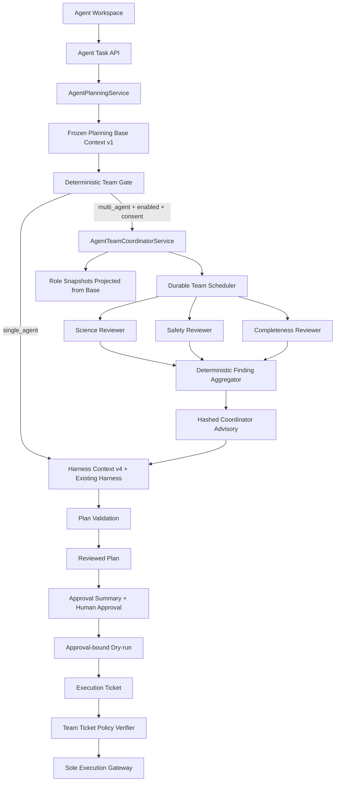

# 阶段十四：生产多 Agent 架构规格与实施总览

> **方案状态：已批准（设计）/ 本轮正式延期（Deferred）**
>
> 2026-10-02 经维护者决定：本阶段冻结在 G0 之前，本轮不进入 G1+ 生产编码，也不补齐
> G0 缺口工具；多 Agent 的净收益至今没有任何真实证据。下列 10 份子方案保留为经审阅的
> 设计权威，但不是实施授权。重启条件见 §11。
>
> **源码实现状态：生产多 Agent 未实施（NOT IMPLEMENTED）；离线 G0 脚手架部分存在（PARTIAL）**
>
> - 无任何生产 Team 实现：`src/backend/app/services/mock_store.py` 的 39 张建表语句中
>   不存在 team/worker/finding/mailbox/advisory 表；`AgentHarnessAttempt.mode` 仍固定为
>   `Literal["single_agent"]`（`src/backend/app/schemas/agent_harness.py:200`）；
>   `src/backend/app/api/` 无 `/team` 路由；`core/config.py` 与 `.env.example` 均无
>   `MEDIMAGE_MULTI_AGENT_ENABLED`。
> - 受控边界未回退：`AgentHarnessActionKind` 只有 `request_decision`/`draft_plan`
>   （`schemas/agent_harness.py:25`），`runtime/agent_capability_catalog.py` 对 A0/A1
>   fail-closed（`:29`、`:33`、`:44`），未向模型暴露执行或 scope 变更动作。
> - 已存在的只有离线脚手架：`services/agent_review_role_registry.py`、
>   `services/agent_review_context_projector.py`、`services/agent_review_finding_aggregator.py`、
>   `services/structured_agent_model_adapter.py`、`services/multi_agent_gate_runner.py`、
>   `services/multi_agent_evaluation_service.py`、`schemas/agent_eval.py`、
>   `scripts/run_multi_agent_evaluation.py`。**这些模块不构成 G0 证据，也不构成任何实施授权。**
> - G0 六项硬阻塞见 §11.1，其中任一项未清除前 G0 不可能通过。
>
> 任务模式：Architecture / Refactor + Feature Bundle（本轮实际执行为 Documentation）
>
> 前置基线：阶段十三已完成单 Agent 主链、持久化唤醒、环境绑定、运行时自检、DAG 和统一沙箱收敛
>
> 上游决策：`specs/阶段记录/已完成实施方案/阶段十三/Agent架构收敛/07_多Agent延期条件与后续评估方案.md`
>
> 历史背景（非实现权威）：`docs/架构与决策/多Agent协作运行时设计与实施计划.md` 自标
> `Superseded as implementation authority`，与本文冲突时以本文为准。
>
> 阶段归属划分见 §11.3：本阶段是多 Agent 审查范围与 G0 Gate 的唯一权威；
> `specs/阶段记录/阶段十六/借鉴Muse设计架构进行优化改进.md` §12/§22.6/Phase 8 的两
> reviewer 口径在本阶段被取代。

## 1. Scope Anchor

**目标**：在不增加第二个规划、审批或执行所有者的前提下，为复杂 Agent Task 增加默认关闭、显式启用、最多三个只读评审者的生产多 Agent 规划审查能力。

**必须满足**：

- 先以隔离真实 runner 执行人工标注、脱敏的 Trace/Replay 评估集并通过准入门，再修改生产运行时；禁止信任 fixture 自报结果。
- 顶层任务仍只有一个 `AgentLifecycleRecord`；Team、Worker、Finding 都是其从属记录。
- 多 Agent 只作用于规划前审查；最终计划仍由现有单一 `AgentPlanningService` 生成、校验和持久化。
- Coordinator 的状态、调度、预算、聚合和失败处理必须是确定性服务；模型只能返回严格 schema 数据。
- Worker 只能读取冻结、裁剪、哈希绑定的 typed context，不得读取原始影像字节或任意文件。
- Worker 不得拥有 Approval、Execution Ticket、Execution Gateway、runner、shell、filesystem、network、MCP 或 Memory 写能力。
- Team advisory 必须绑定 project、lifecycle、context、model profile、prompt、schema、policy 和 finding hash。
- Team advisory 进入规划输入后，必须被 Reviewed Plan 和 Approval Summary 的哈希链覆盖。
- lifecycle 必须持久化 current Team id/epoch；旧 Team、旧 wake 和迟到结果不能进入新 planning attempt。
- `single_agent` 继续是默认和完整可用路径；首期不提供 `auto` 模式。
- rawdata、BIDS、NIfTI 和已登记源数据保持只读；不改变任何科学能力等级。

**明确禁止**：

- 递归 spawn、Worker 创建 Worker、peer-to-peer 自由聊天、动态角色和动态工具授权。
- 多个 Agent 并行执行 pipeline、node runner、MATLAB、SPM、DPABI、GPU 或外部命令。
- Worker 修改计划、创建用户决定、批准执行、签发票据、宣布任务成功或覆盖 Goal Evaluator。
- 把 Agent 消息、模型置信度或多数投票当作安全事实、审批或科学验证。
- 为新旧 Team schema 建立兼容层、fallback reader、迁移双写或第二套公共 API。

## 2. Intent & Vision

### 2.1 问题陈述

当前生产链只有单 Agent。它的控制边界已经稳定，但在跨科学前提、项目证据和安全范围的复杂目标中，单次模型审查可能遗漏阻断问题。阶段十三 synthetic 离线预检表明只读多角色审查可能提高遗漏召回，但由于没有真实脱敏 Trace/Replay，尚不足以证明生产收益。本阶段先补齐真实证据，再用最小生产架构把收益限制在规划审查层。

### 2.2 目标用户

| 用户 | 主要需求 |
|---|---|
| rs-fMRI 研究人员 | 复杂目标在审批前获得独立的科学、安全和完整性检查 |
| 项目管理员 | 控制模型数据边界、成本预算、开关和项目 consent |
| 运维与审计人员 | 能解释每个 Worker 看到了什么、输出了什么、为何聚合或拒绝 |
| 开发与验证人员 | 有确定性回放、故障注入、项目隔离和回归证据 |

### 2.3 成功标准

| ID | 标准 | 验证目标 |
|---|---|---|
| SC-01 | 真实脱敏评估通过 | 隔离 runner 在至少 150 个 held-out case 上真实执行；关键遗漏召回提升和误报率的 95% 置信界均通过 |
| SC-02 | 单一写所有者 | Worker/Coordinator model 对 lifecycle、plan、approval、ticket、run 写调用均为 0 |
| SC-03 | 项目隔离 | 任意跨项目 snapshot、finding、team、task 引用均结构化拒绝 |
| SC-04 | 可恢复 | 在每个持久化边界崩溃后重启，不重复模型调用、不重复 finding、不重复 finalize |
| SC-05 | 安全失败 | safety reviewer 缺失、引用漂移、预算耗尽或聚合冲突均不能形成可审批 advisory |
| SC-06 | 完整调用链 | create request、store、scheduler、planner、read model、API、前端、i18n、Trace、运维指标全部接通 |
| SC-07 | 单 Agent 不退化 | Team 全局关闭时，现有单 Agent contract、状态、审批和执行测试保持通过 |
| SC-08 | 生产验证 | 后端、前端、Electron check、Windows 打包和隔离 smoke 均通过 |

## 3. 约束登记

| C-ID | 类型 | 约束 | 优先级 | 证明方式 |
|---|---|---|---|---|
| C-001 | REQUIREMENT | 隔离真实 runner 的脱敏 Trace/Replay Gate 是生产编码前置条件 | MUST | 分离 labels/run records、冻结 manifest/source/role/model hashes、评估报告和批准记录 |
| C-002 | INVARIANT | `AgentLifecycleRecord` 是唯一顶层任务状态 | MUST | 状态依赖测试和数据库表审查 |
| C-003 | INVARIANT | 现有 planner 是唯一计划写 owner | MUST | write spy、依赖扫描和计划 hash 测试 |
| C-004 | INVARIANT | Approval Gate、Ticket、Gateway 顺序不变 | MUST | 有序调用日志和副作用测试 |
| C-005 | LIMITATION | 首期最多三个代码内置只读角色 | MUST | schema 枚举、角色注册表和 max workers 测试 |
| C-006 | LIMITATION | 首期只有 `single_agent` 和显式 `multi_agent`，无 `auto` | MUST | API/schema/配置测试 |
| C-007 | REQUIREMENT | 所有上下文和 finding 均 typed、frozen、extra-forbid、canonical hash | MUST | Pydantic contract 和 hash golden tests |
| C-008 | INVARIANT | Worker 无执行、审批、写入和权限授予能力 | MUST | capability broker deny tests 和 import boundary tests |
| C-009 | REQUIREMENT | Team 状态、预算、lease、事件和 wake 持久化 | MUST | SQLite 重启与故障注入测试 |
| C-010 | REQUIREMENT | GET/read model 无 reconcile、调度和状态迁移副作用 | MUST | store spy API tests |
| C-011 | INVARIANT | rawdata 和登记源数据只读 | MUST | 路径、context projection 和数据外发测试 |
| C-012 | REQUIREMENT | Team 全局开关默认关闭，项目 consent 默认关闭 | MUST | ConfigService 和项目设置测试 |
| C-013 | REQUIREMENT | 新 contract 同步后端、前端、i18n、测试和文档 | MUST | contract matrix 和废弃字段全仓搜索 |
| C-014 | LIMITATION | 本阶段不改变科学算法或能力等级 | MUST | capability matrix diff 审查 |
| C-015 | PREFERENCE | 优先复用现有 context、model call、wake、Trace、Replay 和运维模式 | SHOULD | 实施 diff 与现有模式对照 |
| C-016 | INVARIANT | lifecycle current Team id/epoch 是唯一 planning binding | MUST | CAS、旧 wake/迟到 finalize 和多个 terminal Team 测试 |
| C-017 | REQUIREMENT | G0 与生产复用同一 role registry 和 pure finding aggregator | MUST | 模块 identity/hash 和规则变更强制重跑 Gate |
| C-018 | REQUIREMENT | 每次 provider 调用前复验 project consent epoch/hash | MUST | 四时点 consent revoke 测试 |
| C-019 | REQUIREMENT | Harness action provider 必须看到 typed advisory，未解决 blocking finding 不能被忽略 | MUST | Context v4 request capture 和 action validation 测试 |
| C-020 | INVARIANT | Team policy/consent/base/context/advisory identity 必须贯穿 Approval Summary 与 Execution Ticket，并在 consume 前复验 | MUST | approve/dry-run/issue/consume 漂移与 revoke race tests |

### 3.1 当前基线证据

> 2026-10-02 按当前源码逐条重新定位锚点。原表全部行号已因阶段十二/十五/十六的代码演进
> 漂移，其中 `multi_agent_evaluation_service.py:112-211` 甚至超出该文件实际长度（150 行）。
> 后续引用以下列锚点为准。

| 事实 | 当前锚点 | 对本阶段的约束 |
|---|---|---|
| Harness attempt 目前只允许 `single_agent` | `src/backend/app/schemas/agent_harness.py:192-200`（`mode` 在 `:200`） | 生产实现必须同步切换 schema 和全部消费者，不能保留双格式 reader |
| Harness 动作空间只有两种 kind，且 catalog fail-closed | `schemas/agent_harness.py:25`、`runtime/agent_capability_catalog.py:29`、`:33`、`:44` | 阶段十四不得隐式扩大动作空间；动作空间扩展属阶段十六/阶段十二-03 的独立获批事项 |
| Context v3 已按十个 section 冻结和哈希 | `schemas/agent_harness.py:26-37`（section 枚举）、`:259`、`:270`、`:287-292`（`schema_version: Literal[3]` 在 `:292`）、构建点 `services/agent_harness_context_service.py:189` | 实施时把十 section builder 单一切换为不含 advisory 的 Base v1，再于 Team 后构建 Harness Context v4；不能形成上下文循环 |
| Multi-agent 现有结构仅是离线评估合同 | `schemas/agent_eval.py:148`（`AgentReviewerKind`）、`:170`、`:183`、`:226`、`:275`、`:306`、`:326`、`:346` | 不能把评估对象直接当生产 authority |
| 离线聚合已有引用、去重、冲突和 Gate 原型 | `services/multi_agent_evaluation_service.py:18`、`:26-150`；纯聚合规则在 `services/agent_review_finding_aggregator.py:31-64` | 生产聚合需复用语义并增加持久身份/权限边界 |
| Agent planning advance 是现有规划接入 seam | `services/agent_planning_service.py:289`（`advance_planning`）、`:361`（`_harness_or_plan`）、`:493`（`_plan`） | Team 完成后只能唤醒该主链 |
| PlanningRequest 在单一服务中构建并哈希 | `services/agent_planning_service.py:668` | advisory identity 必须进入真实 request hash |
| Agent Task scheduler 已有 durable wake/lease/shutdown 模式 | `services/agent_task_scheduler.py:23-194`（`rescan` `:156`、`recover_once_on_startup` `:184`、`shutdown` `:194`） | Team scheduler 复用模式但保持 typed 独立记录 |
| 模型调用账本已存在 | `schemas/agent_harness.py:114`（`ModelCallRecord`）、`services/agent_harness_service.py:298-458` | 共享 adapter 只统一调用协议，不得混淆 durable owner |
| Trace/Replay 已是只读投影和纯校验 | `services/agent_trace_service.py:31`、`services/agent_replay_service.py:14` | Team 只能扩展安全摘要与纯 reducer 校验 |
| Team 从属状态无任何持久化落点 | `services/mock_store.py` 39 张建表均不含 team/finding/advisory；`agent_harness_contexts` 表在 `:314` | G1 前不得假称存在 Team 存储 |
| 当前默认没有真实模型后端 | `.env.example:28`（`MEDIMAGE_AGENT_MODEL_ENABLED=false`）、`:29`（`MEDIMAGE_AGENT_MODEL_PROVIDER=rule_based`）、`:39`（`MEDIMAGE_AGENT_HARNESS_ENABLED=false`） | G0 要求真实 provider 双臂执行，当前配置下不可能满足；见 §11.1 B3 |

## 4. 规格矛盾检查

| 检查 | 结果 | 处理 |
|---|---|---|
| 多 Agent 并行与单一状态所有者 | 可兼容 | 并行范围仅限只读 Worker；确定性 Coordinator 唯一写 Team 从属状态 |
| 多模型调用与预算/延迟上限 | 由 G0 实证决定 | 端到端统计 reviewer、repair、retry 和主 planner；95% 置信门槛失败则不实施 |
| 故障恢复与不重复副作用 | 可兼容 | 每个模型请求和 finding 使用持久幂等键、lease 与 fencing token |
| 独立审查与最小数据披露 | 可兼容 | 每个角色使用独立 purpose projection，不复制完整父上下文 |
| Team 失败与单 Agent 可用 | 可兼容 | 单 Agent 是独立默认路径；显式 Team 失败进入 handoff，不静默伪装为已完成 Team 审查 |
| 多 Agent 与唯一审批/执行链 | 无冲突 | advisory 只是 planner 输入，不能进入执行面 |

未发现需要阻塞方案编写的逻辑矛盾。生产实现仍被 G0 真实评估证据门阻塞，这是有意的 capability gate，而非规格歧义。

## 5. 已锁定设计决策

| D-ID | 决策 | 结论 | 原因 |
|---|---|---|---|
| D-001 | 协作拓扑 | 扁平 `Coordinator -> 3 reviewers` | 有界、可审计，避免递归权限扩散 |
| D-002 | 生产角色 | `science`、`safety`、`completeness` | 与阶段十三评估合同一致，减少合同漂移 |
| D-003 | 启用方式 | 全局 flag + 项目 consent + 每任务显式 `multi_agent` | 三重门控，首期不自动路由 |
| D-004 | 失败策略 | 显式 Team 失败进入 `needs_attention`/handoff | 不静默降级后声称经过 Team 审查 |
| D-005 | 规划所有权 | 先冻结不含 advisory 的 PlanningBaseContext v1 供 reviewer 使用；聚合后另建 Harness Context v4，并从 `advance_planning -> _harness_or_plan` 进入单一 planner | 避免上下文循环，不建立第二规划链，确保 action provider 实际看到 advisory |
| D-006 | 通信 | 无通用 mailbox；首期只持久化 typed finding 和系统事件 | 避免自由文本通信和无必要抽象 |
| D-007 | 模型访问 | 只能调用统一 structured model adapter | Provider 身份、请求哈希、预算和审计一致 |
| D-008 | 发布策略 | 默认关闭的内部 opt-in，验收后仍不启用 `auto` | 控制生产影响面 |
| D-009 | Team 版本权威 | lifecycle 保存 current Team id + epoch，所有记录/唤醒/规划绑定 epoch | 防止旧 Team 和迟到结果污染新规划 |
| D-010 | Eligibility | 显式 multi 仍必须通过确定性复杂度/可拆分规则 | 保证 ineligible case 不启动 Worker |
| D-011 | G0 证据 | Manifest 只含 inputs/labels；实际指标来自 append-only 隔离 run records | 防止手工调 fixture 制造 Gate 通过 |
| D-012 | 执行资格绑定 | Team policy/consent/base/context/advisory identity 冻结到 ticket，并在 consume 前 fail closed 复验 | 关闭签发后到 dispatch 前的策略漂移竞态，不新增执行入口 |

## 6. 目标调用链

```mermaid
flowchart TD
    UI["Agent Workspace"] --> API["Agent Task API"]
    API --> PLAN["AgentPlanningService"]
    PLAN --> BASE["Frozen Planning Base Context v1"]
    BASE --> ELIG["Deterministic Team Gate"]
    ELIG -->|single_agent| HARNESS["Harness Context v4 + Existing Harness"]
    ELIG -->|multi_agent + enabled + consent| COORD["AgentTeamCoordinatorService"]
    COORD --> SNAP["Role Snapshots Projected from Base"]
    COORD --> SCHED["Durable Team Scheduler"]
    SCHED --> SCI["Science Reviewer"]
    SCHED --> SAFE["Safety Reviewer"]
    SCHED --> COMP["Completeness Reviewer"]
    SCI --> AGG["Deterministic Finding Aggregator"]
    SAFE --> AGG
    COMP --> AGG
    AGG --> ADV["Hashed Coordinator Advisory"]
    ADV --> HARNESS
    HARNESS --> VALID["Plan Validation"]
    VALID --> RP["Reviewed Plan"]
    RP --> APPROVAL["Approval Summary + Human Approval"]
    APPROVAL --> DRY["Approval-bound Dry-run"]
    DRY --> TICKET["Execution Ticket"]
    TICKET --> VERIFY["Team Ticket Policy Verifier"]
    VERIFY --> GATEWAY["Sole Execution Gateway"]
```

## 7. 实施顺序和硬 Gate

| Gate | 阶段 | 允许进入下一阶段的证据 |
|---|---|---|
| G0 | 真实脱敏评估 | labels/run records 分离，隔离真实 baseline/candidate runner，150+ held-out case 置信门槛通过，capability review 批准 |
| G1 | Contract 与 Store | schema、SQLite、事务、幂等、project isolation 测试通过 |
| G2 | Worker Runtime | 三角色只读运行、预算、超时、拒绝非法输出和无副作用证明 |
| G3 | Coordinator 与恢复 | DAG、lease、fencing、取消、重启、聚合和 handoff 测试通过 |
| G4 | 单一规划链接入 | base/advisory hash 进入 PlanningRequest/Reviewed Plan/Approval Summary/Ticket；approve/dry-run/issue/consume 复验；无第二 planner |
| G5 | API、前端与可观测性 | contract、i18n、只读详情、状态、指标和 Trace 完整 |
| G6 | 对抗与全量回归 | 注入、漂移、跨项目、重复、崩溃、预算、安全审查失败全部安全关闭 |
| G7 | 打包与灰度 | frontend/backend/Electron/packaged smoke 通过，默认仍关闭 |

不得跳过 G0，不得在前一 Gate 未完成时接入后一阶段公共表面。

## 8. 文档套件

| 文件 | 责任 |
|---|---|
| `01_真实脱敏TraceReplay准入方案.md` | 建立生产实现的证据准入门 |
| `02_角色合同与能力边界方案.md` | 固定角色、输入输出和 deny-by-default 权限 |
| `03_状态模型持久化与恢复方案.md` | 定义 Team 从属状态、SQLite、事务、lease 和恢复 |
| `04_协调调度聚合与规划链接入方案.md` | 定义并行调度、确定性聚合和唯一 planner 接入 |
| `05_API前端与可观测性方案.md` | 定义公共 contract、UI 状态、Trace 和运营指标 |
| `06_安全审批与科学真实性方案.md` | 证明多 Agent 不扩大审批、执行和科学声明权限 |
| `07_逐文件实施台账.md` | 给出可执行的文件级任务、依赖和 DoD |
| `08_测试灰度回滚与最终验收方案.md` | 完整测试矩阵、灰度、回滚和最终验收 |
| `09_人工评审与实施检查清单.md` | 记录 capability review 和逐 Gate 签字项 |
| `10_规格怀疑式审查报告.md` | 记录三轮规格审查结论、已关闭问题和 READY_FOR_G0 边界 |

## 9. 假设登记

| A-ID | 假设 | 分类 | 证据 | 错误影响 |
|---|---|---|---|---|
| A-001 | 当前单 Agent 主链继续作为生产基线 | VERIFIED | `agent_harness.py:192-200`、阶段十三验收 | 若基线变化，所有接入点需重新探索 |
| A-002 | 三种评审角色足以覆盖首期收益 | NEEDS_VERIFICATION | synthetic 预检和第 07 方案 | 真实评估可能否决生产实现 |
| A-003 | 真实 Trace/Replay 可以在不保留 PHI、rawdata 和完整 prompt 下脱敏，并允许统一 provider 在批准范围内实际回放 | CRITICAL | 尚待 G0 数据与 provider policy 审查 | 若不能满足，阶段十四停止在 G0 |
| A-004 | 现有 SQLite 可承载从属 Team 状态 | VERIFIED | Harness/wake/ticket 已使用同一事务存储模式 | 若规模不足，需要重新做存储评审，不能直接换库 |
| A-005 | 现有 structured model adapter 可扩展角色 prompt | NEEDS_VERIFICATION | 当前模型调用账本和严格动作 schema | 若接口不足，只能做同步替换，不能复制 provider |

### 9.1 Ambiguities & RFIs

当前没有阻塞方案设计的未决产品选择。三角色、显式启用、首期无 `auto`、无 synthesis model、失败 handoff、G0 前置、epoch 权威、eligibility、真实 run evidence 和 ticket preflight 均已在 D-001 至 D-012 锁定。真实脱敏数据是否可获得是 A-003/G0 capability condition；若不成立，结论是停止生产实现，而不是在实现过程中猜测或放宽数据边界。

## 10. 本阶段完成定义

本次“制定方案”完成的条件：

- [x] 范围、非目标、约束、假设和硬 Gate 明确。
- [x] 生产架构保持唯一 lifecycle、planner、approval 和 execution owner。
- [x] 真实数据准入、角色合同、持久化、调度、API、前端、安全和验证均有专项文档。
- [x] 每个实施阶段都有文件级任务、风险、测试和退出条件。
- [ ] G0 真实脱敏评估通过并获得人工 capability review 批准。
- [ ] 生产代码实施、全量验证与灰度发布完成。

后两项属于下一次实施任务，不因本方案文档完成而自动视为已授权。2026-10-02 的处置结论见
§11：本阶段在 G0 之前正式延期，后两项在本轮**不授权**，也不安排。

---

## 11. 2026-10-02 延期结论、G0 硬阻塞与重启条件

### 11.1 G0 当前不可通过的六项硬阻塞

以下结论按 2026-10-02 当前 `main` 源码复核得出，不是推断。任一项未清除前，`01` 的 G0
退出条件在物理上无法满足，因此也不得进入 G1+。

| ID | 阻塞 | 当前证据 |
|---|---|---|
| B1 | 没有真实脱敏语料 | `tests/fixtures/agent_eval/multi_agent/` 是空目录；全仓 `tests/fixtures/agent_eval/` 下只有 `v2/manifest.json`。而 `schemas/agent_eval.py:226` 的 `MultiAgentEvalManifest` 已硬性要求 `cases` 至少 30 例、acceptance 分组 ≥150 例、每语言 ≥40 例、每组 ≥50 例、reference blocking code ≥120，且 `source_kind` 只能是 `trace_replay_redacted`——现有语料为零，任何 manifest 校验都无从加载 |
| B2 | 没有从生产 Trace 导出脱敏数据集的链路 | `services/agent_trace_service.py:31` 只构建只读 trace 视图，`agent_replay_service.py:14` 只做纯校验；两者都不写 fixture，也不存在人工双标注/裁决所需的 `redaction_review_ids`、`label_review_ids` 采集工具 |
| B3 | 没有可真实调用的模型后端 | `.env.example:28` `MEDIMAGE_AGENT_MODEL_ENABLED=false`，`:29` `MEDIMAGE_AGENT_MODEL_PROVIDER=rule_based`；`services/structured_agent_model_adapter.py:22-23` 只声明 `StructuredReviewProvider` Protocol（全文件 39 行），无任何 provider 实现。`01` §6.1 要求的“双臂真实执行”当前只能得到 rule_based 伪结果，不构成模型评估证据 |
| B4 | 没有具体隔离执行器 | `services/multi_agent_gate_runner.py` 的 `IsolatedGateArmExecutor` 只是 Protocol；全仓唯一实现是 `tests/integration/test_multi_agent_gate_runner.py:18` 的 stub `_Executor`（该文件只有 1 个测试）。`MultiAgentGateRunner.run()` 无法驱动真实 lifecycle/Harness |
| B5 | 冻结哈希未真正绑定实现 | `agent_review_context_projector.py:70-71` 的 `context_projector_hash()` 与 `agent_review_finding_aggregator.py:67-68` 的 `aggregation_policy_hash()` 都对**硬编码字符串常量**取 SHA-256，改实现不改哈希。`01` §5 与 C-017 要求的“任一变化必须生成新评估 run / 规则变更强制重跑 Gate”实际未成立。（`agent_review_role_registry.py:36-38` 的 `role_registry_hash()` 确实对 registry 载荷取哈希，是唯一真实的一项） |
| B6 | reviewer 投影未从权威 section 派生 | `agent_review_context_projector.py:44-48` 使用的 section 名为 `capability`、`evidence`、`scope`、`environment`、`coverage`，这五个**都不在** `schemas/agent_harness.py:26-37` 声明的十个权威 section（`goal`/`policy`/`project_evidence`/`decision_state`/`plan_state`/`execution_state`/`latest_observation`/`last_action_result`/`memory_context`/`budget`）中。因此现有投影是一套并行词汇表，并未从 `AgentPlanningBaseContext v1` 派生，与 `02` §3、`07` T2.1 的前提不符 |

补充：`01` §9 推荐的验证命令缺少 `scripts/run_multi_agent_evaluation.py` 的必填参数
`--bundle`（该参数 `required=True`），照抄必然以退出码 2 失败。整个离线脚手架目前只有
`tests/unit/test_multi_agent_evaluation.py` 的 4 个测试和 1 个集成测试覆盖。

### 11.2 本轮决定与承担风险

- **决定**：阶段十四在 G0 之前正式延期；本轮不进入 G1+，也**不**补齐 B1–B6 的工具缺口。
- **理由**：多 Agent 相对单 Agent 的净收益至今没有任何真实证据——阶段十三的离线预检仅使用
  synthetic 样例并已判定门槛未达（`已完成实施方案/阶段十三/Agent架构收敛/07_…` §状态行）。
  B1/B2 需要真实使用数据和人工双标注投入，B3 需要单独的联网 provider 授权与额度预算。
  在这些前提不成立时先造导出工具，等于为未确认需求预先引入抽象，违反 `AGENTS.md` §3.0。
- **承担的风险**：若真实遗漏（mis-omission）确实是复杂目标的瓶颈，本阶段延期意味着该瓶颈继续
  由单 Agent 承担，短期内无缓解；同时 `01`–`10` 的设计细节会随上游契约演进而继续漂移，重启时
  必须重新做一次全量源码复核而不是直接照做。**接受该风险**，因为它只影响一个默认关闭、
  且从未产生任何用户可见能力的路径，不影响任何已交付功能、审批顺序或科学能力等级。
- **不得外推**：本轮不改变任何能力等级。离线 gate 脚手架存在 ≠ G0 通过 ≠ 多 Agent 实施授权；
  任何表面都不得标为 `computed` 或 `validated`（`AGENTS.md` §3.6、§5.7）。若将来生成合成
  fixture，必须显式标 `preview_only`/`partial`，不得冒充真实样本——这也是 `01` §9 T0.1 台账
  中“未批准前不得创建占位数据冒充真实样本”仍然有效的原因。

### 11.3 重启触发条件（全部满足才可申请重新立项）

1. 具备可导出、可双人标注的真实脱敏 Trace 语料，数量满足 `schemas/agent_eval.py:226` 的
   `MultiAgentEvalManifest` 硬校验（≥30 pilot + ≥150 独立 held-out acceptance，双语各 ≥40，
   三组各 ≥50，reference blocking code ≥120），并完成不可逆脱敏审查（清除 B1、B2）。
2. 维护者单独批准联网 provider 评估，给出 endpoint 配置指纹、模型/额度与总调用上限；
   凭据不得进入仓库或报告（清除 B3）。
3. 存在具体的 `IsolatedGateArmExecutor`，通过 dependency override 接入真实 lifecycle/Harness
   与真实 structured provider，而不是 stub（清除 B4）。
4. `context_projector_hash()` 与 `aggregation_policy_hash()` 改为对模块源码或规则载荷取哈希，
   使 `01` §5 与 C-017 的冻结语义真正成立（清除 B5）。
5. reviewer section 词汇表收敛到 `agent_harness.py:26-37` 的十个权威 section，并从
   `AgentPlanningBaseContext v1` 派生投影（清除 B6）。
6. 重启前必须先重跑一次 `spec-plan-archive-audit` 级别的全量源码复核，因为本文与 `01`–`10`
   的锚点在阶段十二/十五/十六演进后已再次漂移。
7. 上述任一条件不成立时，G0 结论必须是 `continue_single_agent`（`01` §7）。

### 11.4 阶段归属划分（避免双权威）

| 主题 | 唯一权威 | 说明 |
|---|---|---|
| 多 Agent 规划前审查的角色、状态模型、调度、审批绑定与 G0–G7 Gate | **本阶段（阶段十四）** | 处于延期状态，但仍是该主题的设计权威 |
| “真实脱敏多 Agent 评测”这项待办的归属 | **本阶段** | `specs/阶段记录/阶段十二/Agent改造/13_多Agent协作评估方案.md` 已正式把它交给阶段十四；本阶段延期即代表该评测同步延期，不得被解读为已完成 |
| 阶段十三的多 Agent 离线预检结论与门槛定义 | `已完成实施方案/阶段十三/Agent架构收敛/07_…` | 历史结论，已完成归档；其“继续延期”判定不因阶段十四延期而改变 |
| Harness 动作空间扩展（`inspect`/读工具/新 kind） | **阶段十六**（`specs/阶段记录/阶段十六/借鉴Muse设计架构进行优化改进.md`） | 与本阶段正交。`AGENTS.md` §5.4/§3.2 下动作空间扩展必须独立获批。**2026-10-02 状态更新**：该范围已由阶段十六 §0.4-D2 评估并判定**不获批、正式跳过**，因此它不是“等待放行的待办”；重启条件见阶段十六 §0.4-D2。本阶段延期不因该判定而改变。 |
| 阶段十六 §12（Scientific + Safety **两** reviewer）、§22.6、Phase 8 | **被本阶段取代** | 角色口径以本阶段 `02` §2 的三固定只读角色（`science`/`safety`/`completeness`）为准；§12.6/§22.6 “继续使用现有 Gate” 中的“现有 Gate”即本阶段 `01`，阶段十六 不得另立第二套评估门槛 |
| 旧设计文档 `docs/架构与决策/多Agent协作运行时设计与实施计划.md` | 非实现权威 | 自标 `Superseded as implementation authority`，只保留调研背景 |

`阶段十六` §12 与本阶段的两/三角色分歧，已按上表裁定为本阶段优先；该分歧本身不是逻辑矛盾
（两 reviewer 是三 reviewer 的子集），但**不得**在两套口径下同时维护实施台账。
